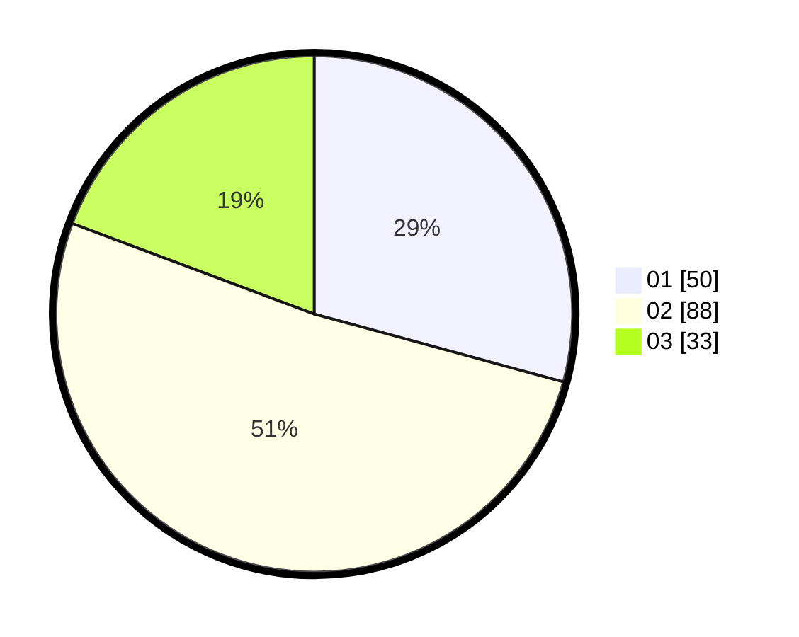

# Hasil

Hasil perolehan suara paslon dapat dilihat pada file paslon-01.txt, paslon-02.txt, dan paslon-03.txt.

Jika tidak ada, artinya data tersebut belum ada pada SIREKAP.

## Perolehan Suara

 * Paslon 01: **50**.
 * Paslon 02: **88**.
 * Paslon 03: **33**.

## Foto C Plano

https://sirekap-obj-formc.kpu.go.id/1345/pemilu/ppwp/31/75/06/10/02/3175061002024-20240215-002857--4ad89184-2ad5-4194-9ae6-2f8d97c392b3.jpg

https://sirekap-obj-formc.kpu.go.id/1345/pemilu/ppwp/31/75/06/10/02/3175061002024-20240215-002958--96e8d899-db0e-4405-bf3d-8efe6249e715.jpg

https://sirekap-obj-formc.kpu.go.id/1345/pemilu/ppwp/31/75/06/10/02/3175061002024-20240215-003048--60fd6770-a02f-4268-8902-6fd6a73ecea0.jpg
