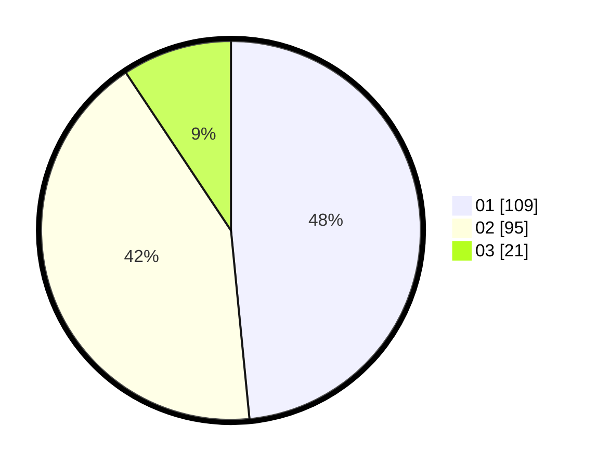

# Hasil

Hasil perolehan suara paslon dapat dilihat pada file paslon-01.txt, paslon-02.txt, dan paslon-03.txt.

Jika tidak ada, artinya data tersebut belum ada pada SIREKAP.

## Perolehan Suara

 * Paslon 01: **109**.
 * Paslon 02: **95**.
 * Paslon 03: **21**.

## Foto C Plano

https://sirekap-obj-formc.kpu.go.id/28a9/pemilu/ppwp/31/75/06/10/02/3175061002032-20240216-060743--af1c7cdc-713e-43e7-abf1-893afb3508f8.jpg

https://sirekap-obj-formc.kpu.go.id/28a9/pemilu/ppwp/31/75/06/10/02/3175061002032-20240216-091955--c3723c06-95d7-449a-b539-8bf2285df3d4.jpg

https://sirekap-obj-formc.kpu.go.id/28a9/pemilu/ppwp/31/75/06/10/02/3175061002032-20240216-060743--104c7a8d-f930-4492-8f05-3454b90c4f6b.jpg

## DATA PEMILIH TETAP

Jumlah pemilih dalam DPT: **290**.
 * L: **148**.
 * P: **142**.

## DATA PENGGUNA HAK PILIH

Jumlah pengguna hak pilih dalam DPT: **221**.
 * L: **110**.
 * P: **111**.

Jumlah pengguna hak pilih dalam DPTb: **5**.
 * L: **2**.
 * P: **3**.

Jumlah pengguna hak pilih dalam DPK: **1**.
 * L: **0**.
 * P: **1**.

Jumlah pengguna hak pilih: **227**.
 * L: **112**.
 * P: **115**.

## JUMLAH SUARA SAH DAN TIDAK SAH

JUMLAH SELURUH SUARA SAH: **225**.

JUMLAH SUARA TIDAK SAH: **2**.

JUMLAH SELURUH SUARA SAH DAN SUARA TIDAK SAH: **227**.
