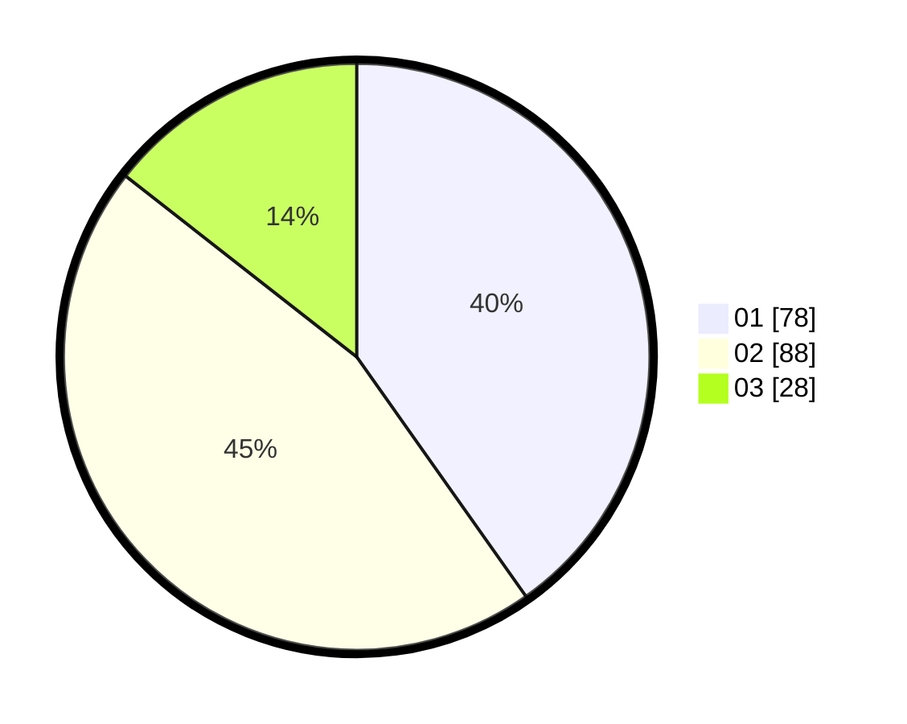

# Hasil

Hasil perolehan suara paslon dapat dilihat pada file paslon-01.txt, paslon-02.txt, dan paslon-03.txt.

Jika tidak ada, artinya data tersebut belum ada pada SIREKAP.

## Perolehan Suara

 * Paslon 01: **78**.
 * Paslon 02: **88**.
 * Paslon 03: **28**.

## Foto C Plano

https://sirekap-obj-formc.kpu.go.id/0537/pemilu/ppwp/31/75/06/10/02/3175061002047-20240215-001349--95f6502a-4a71-4d19-9e86-8ed19fd51e77.jpg

https://sirekap-obj-formc.kpu.go.id/0537/pemilu/ppwp/31/75/06/10/02/3175061002047-20240215-001431--418e22af-e7d1-493c-bc89-501ff339886b.jpg

https://sirekap-obj-formc.kpu.go.id/0537/pemilu/ppwp/31/75/06/10/02/3175061002047-20240215-001747--3a98b6c1-3d21-425d-ab78-863f8b5d81f7.jpg
