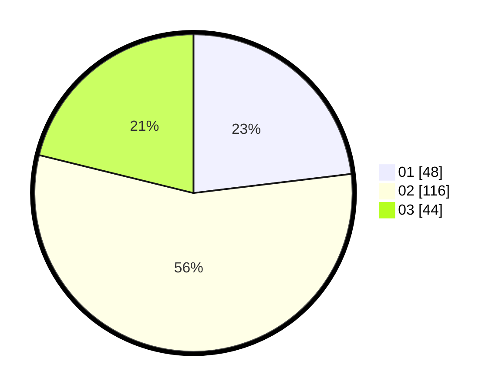

# Hasil

Hasil perolehan suara paslon dapat dilihat pada file paslon-01.txt, paslon-02.txt, dan paslon-03.txt.

Jika tidak ada, artinya data tersebut belum ada pada SIREKAP.

## Perolehan Suara

 * Paslon 01: **48**.
 * Paslon 02: **116**.
 * Paslon 03: **44**.

## Foto C Plano

https://sirekap-obj-formc.kpu.go.id/b823/pemilu/ppwp/31/75/06/10/02/3175061002048-20240214-190928--9895b346-dfef-4a05-bfc9-aa74b0d96639.jpg

https://sirekap-obj-formc.kpu.go.id/b823/pemilu/ppwp/31/75/06/10/02/3175061002048-20240214-191017--3f5c8ddc-1ab1-43d9-b8ba-b8ca4e7b03dd.jpg

https://sirekap-obj-formc.kpu.go.id/b823/pemilu/ppwp/31/75/06/10/02/3175061002048-20240214-191059--4f7a1512-90d6-4366-94d5-669fdbcc68f1.jpg

## DATA PEMILIH TETAP

Jumlah pemilih dalam DPT: **264**.
 * L: **147**.
 * P: **117**.

## DATA PENGGUNA HAK PILIH

Jumlah pengguna hak pilih dalam DPT: **207**.
 * L: **110**.
 * P: **97**.

Jumlah pengguna hak pilih dalam DPTb: **2**.
 * L: **2**.
 * P: **0**.

Jumlah pengguna hak pilih dalam DPK: **3**.
 * L: **1**.
 * P: **2**.

Jumlah pengguna hak pilih: **212**.
 * L: **113**.
 * P: **99**.

## JUMLAH SUARA SAH DAN TIDAK SAH

JUMLAH SELURUH SUARA SAH: **208**.

JUMLAH SUARA TIDAK SAH: **4**.

JUMLAH SELURUH SUARA SAH DAN SUARA TIDAK SAH: **212**.
