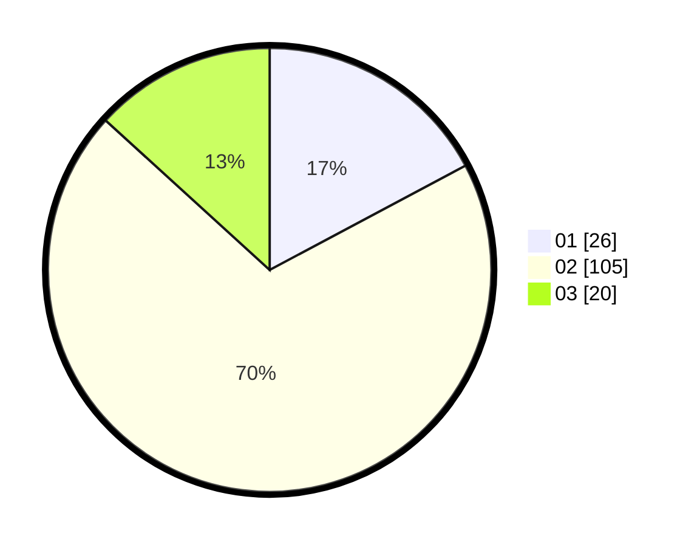

# Hasil

Hasil perolehan suara paslon dapat dilihat pada file paslon-01.txt, paslon-02.txt, dan paslon-03.txt.

Jika tidak ada, artinya data tersebut belum ada pada SIREKAP.

## Perolehan Suara

 * Paslon 01: **26**.
 * Paslon 02: **105**.
 * Paslon 03: **20**.

## Foto C Plano

https://sirekap-obj-formc.kpu.go.id/9f52/pemilu/ppwp/31/75/06/10/02/3175061002049-20240214-222430--5df33f8d-c872-4590-86bc-35e9d0e48944.jpg

https://sirekap-obj-formc.kpu.go.id/9f52/pemilu/ppwp/31/75/06/10/02/3175061002049-20240215-022440--0397c45c-68b8-4390-a114-c05e7e04f132.jpg

https://sirekap-obj-formc.kpu.go.id/9f52/pemilu/ppwp/31/75/06/10/02/3175061002049-20240214-211133--bd775539-3524-4805-98a9-ca2861445079.jpg
