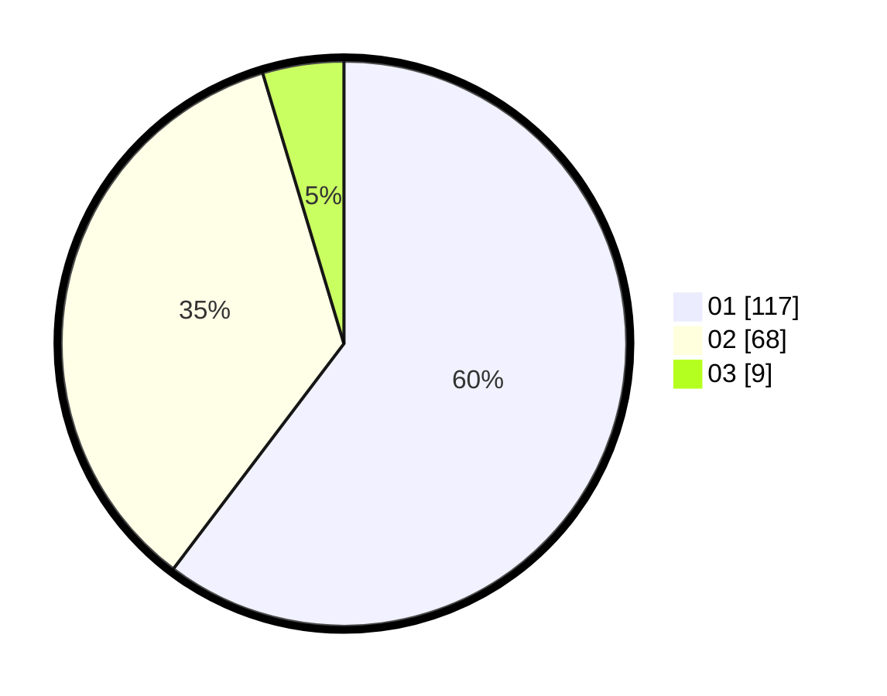

# Hasil

Hasil perolehan suara paslon dapat dilihat pada file paslon-01.txt, paslon-02.txt, dan paslon-03.txt.

Jika tidak ada, artinya data tersebut belum ada pada SIREKAP.

## Perolehan Suara

 * Paslon 01: **117**.
 * Paslon 02: **68**.
 * Paslon 03: **9**.

## Foto C Plano

https://sirekap-obj-formc.kpu.go.id/1b79/pemilu/ppwp/31/75/06/10/02/3175061002060-20240214-230756--90f4e874-6341-43c1-8863-dcb3e0867454.jpg

https://sirekap-obj-formc.kpu.go.id/1b79/pemilu/ppwp/31/75/06/10/02/3175061002060-20240214-231059--989ca667-2a35-4b01-b9dd-40c2ae21f29f.jpg

https://sirekap-obj-formc.kpu.go.id/1b79/pemilu/ppwp/31/75/06/10/02/3175061002060-20240214-231143--9234d981-05b7-498b-b2dc-4b2b9569c6a7.jpg

## DATA PEMILIH TETAP

Jumlah pemilih dalam DPT: **229**.
 * L: **107**.
 * P: **122**.

## DATA PENGGUNA HAK PILIH

Jumlah pengguna hak pilih dalam DPT: **195**.
 * L: **93**.
 * P: **102**.

Jumlah pengguna hak pilih dalam DPTb: **0**.
 * L: **0**.
 * P: **0**.

Jumlah pengguna hak pilih dalam DPK: **0**.
 * L: **0**.
 * P: **0**.

Jumlah pengguna hak pilih: **195**.
 * L: **93**.
 * P: **102**.

## JUMLAH SUARA SAH DAN TIDAK SAH

JUMLAH SELURUH SUARA SAH: **194**.

JUMLAH SUARA TIDAK SAH: **1**.

JUMLAH SELURUH SUARA SAH DAN SUARA TIDAK SAH: **195**.
