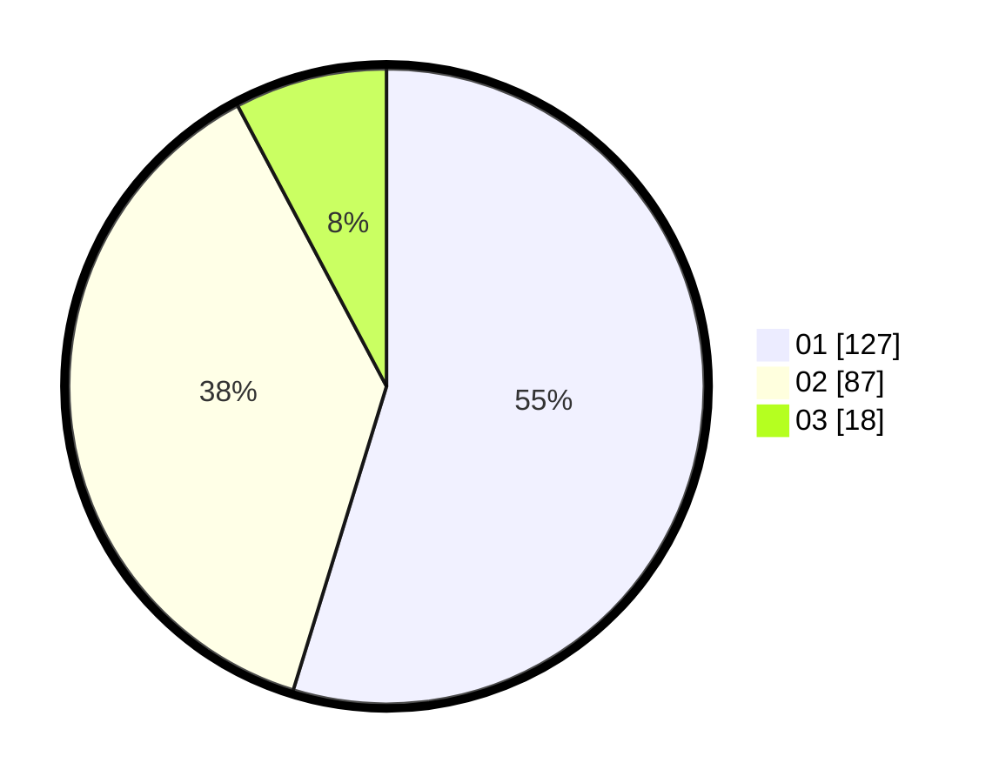

# Hasil

Hasil perolehan suara paslon dapat dilihat pada file paslon-01.txt, paslon-02.txt, dan paslon-03.txt.

Jika tidak ada, artinya data tersebut belum ada pada SIREKAP.

## Perolehan Suara

 * Paslon 01: **127**.
 * Paslon 02: **87**.
 * Paslon 03: **18**.

## Foto C Plano

https://sirekap-obj-formc.kpu.go.id/b3d0/pemilu/ppwp/31/75/06/10/02/3175061002064-20240215-001237--287b5589-fa51-4044-bdc1-85abbb1a2a4d.jpg

https://sirekap-obj-formc.kpu.go.id/b3d0/pemilu/ppwp/31/75/06/10/02/3175061002064-20240215-001332--8dc01acb-ef56-4574-bf37-27f6c2a48361.jpg

https://sirekap-obj-formc.kpu.go.id/b3d0/pemilu/ppwp/31/75/06/10/02/3175061002064-20240215-001428--3660c1a7-11ff-4717-983d-32fe3f904353.jpg
