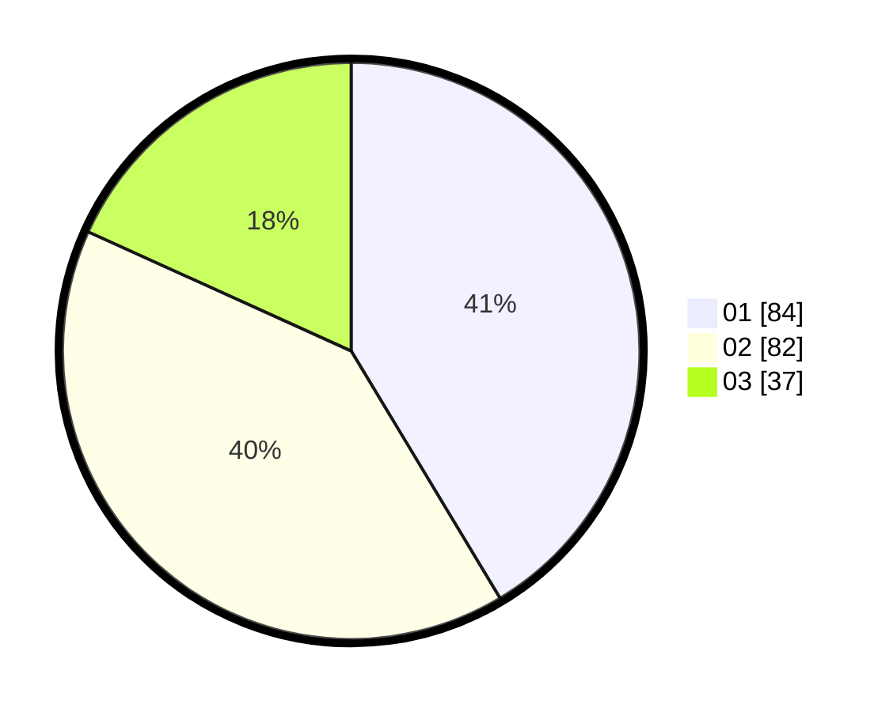

# Hasil

Hasil perolehan suara paslon dapat dilihat pada file paslon-01.txt, paslon-02.txt, dan paslon-03.txt.

Jika tidak ada, artinya data tersebut belum ada pada SIREKAP.

## Perolehan Suara

 * Paslon 01: **84**.
 * Paslon 02: **82**.
 * Paslon 03: **37**.

## Foto C Plano

https://sirekap-obj-formc.kpu.go.id/d5fb/pemilu/ppwp/31/75/06/10/02/3175061002071-20240214-220649--81b17c5d-2f0a-4ee3-ab0b-744489906018.jpg

https://sirekap-obj-formc.kpu.go.id/d5fb/pemilu/ppwp/31/75/06/10/02/3175061002071-20240214-203938--b6df55fe-7732-436a-a140-1090ecde5bee.jpg

https://sirekap-obj-formc.kpu.go.id/d5fb/pemilu/ppwp/31/75/06/10/02/3175061002071-20240214-204046--aca2ba27-4b94-4933-8cc6-646db7a8fd09.jpg
