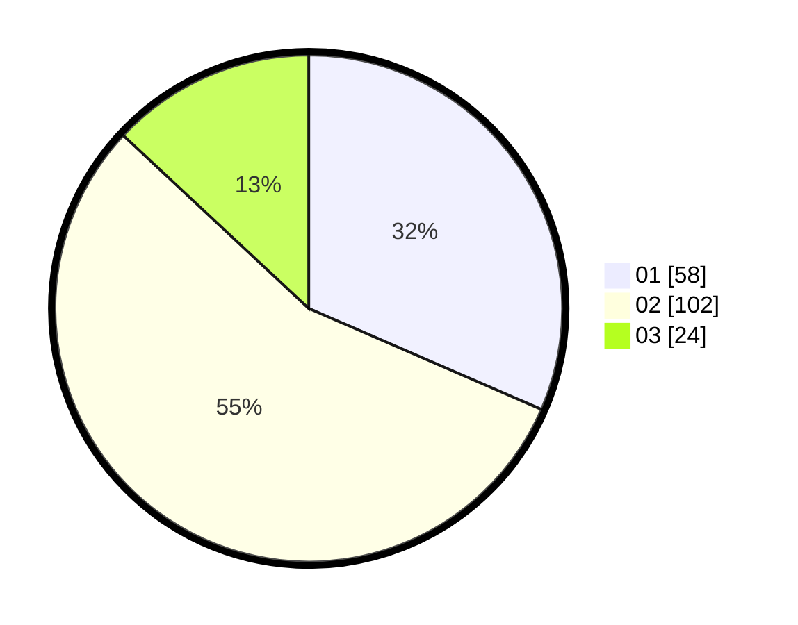

# Hasil

Hasil perolehan suara paslon dapat dilihat pada file paslon-01.txt, paslon-02.txt, dan paslon-03.txt.

Jika tidak ada, artinya data tersebut belum ada pada SIREKAP.

## Perolehan Suara

 * Paslon 01: **58**.
 * Paslon 02: **102**.
 * Paslon 03: **24**.

## Foto C Plano

https://sirekap-obj-formc.kpu.go.id/7eb2/pemilu/ppwp/31/75/06/10/02/3175061002077-20240215-231531--24fd5737-c9d0-4a61-ac2b-ef5bfe126db7.jpg

https://sirekap-obj-formc.kpu.go.id/7eb2/pemilu/ppwp/31/75/06/10/02/3175061002077-20240215-150105--5c3869d3-3a38-458f-9a9e-041aef964d2f.jpg

https://sirekap-obj-formc.kpu.go.id/7eb2/pemilu/ppwp/31/75/06/10/02/3175061002077-20240215-231743--091ec740-b005-443d-aec3-3fa58fa1a81f.jpg
