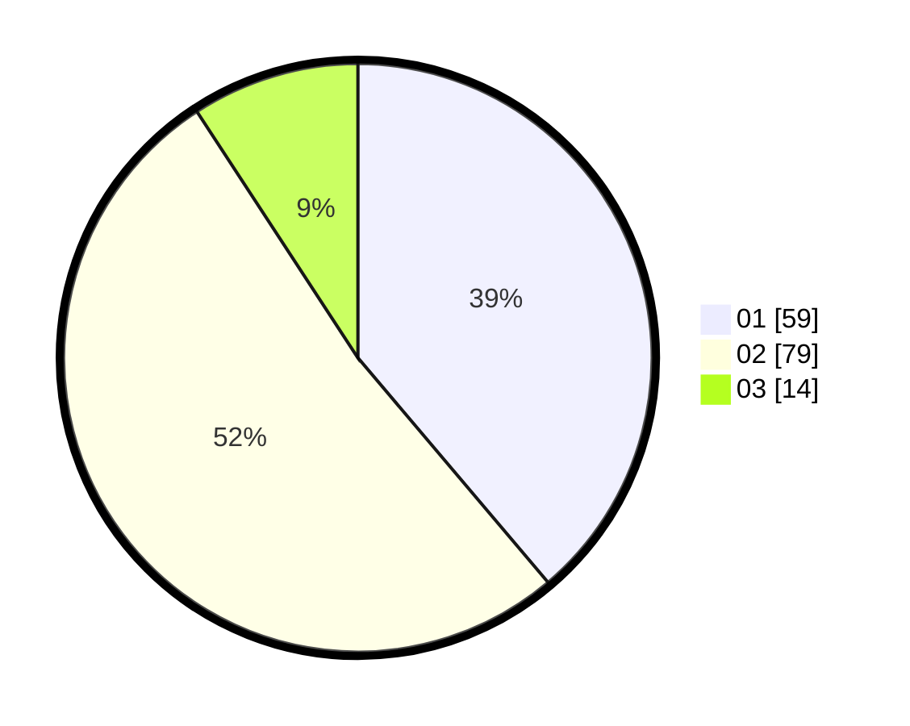

# Hasil

Hasil perolehan suara paslon dapat dilihat pada file paslon-01.txt, paslon-02.txt, dan paslon-03.txt.

Jika tidak ada, artinya data tersebut belum ada pada SIREKAP.

## Perolehan Suara

 * Paslon 01: **59**.
 * Paslon 02: **79**.
 * Paslon 03: **14**.

## Foto C Plano

https://sirekap-obj-formc.kpu.go.id/b9ee/pemilu/ppwp/31/75/06/10/02/3175061002078-20240215-180013--07a6223d-7fd7-4e15-b518-159d6d082f52.jpg

https://sirekap-obj-formc.kpu.go.id/b9ee/pemilu/ppwp/31/75/06/10/02/3175061002078-20240215-172715--42af3989-fd9c-4fc5-a717-aa82fef5e939.jpg

https://sirekap-obj-formc.kpu.go.id/b9ee/pemilu/ppwp/31/75/06/10/02/3175061002078-20240214-234727--6fd7de7d-1dde-4556-b0a8-bc12dec377a1.jpg
