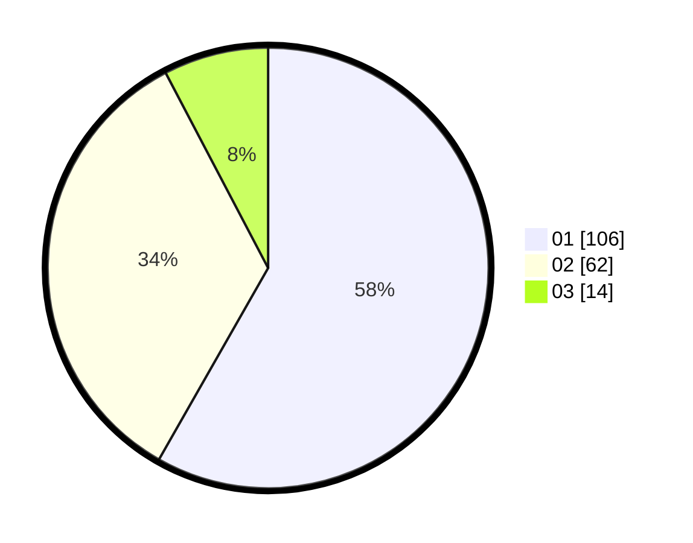

# Hasil

Hasil perolehan suara paslon dapat dilihat pada file paslon-01.txt, paslon-02.txt, dan paslon-03.txt.

Jika tidak ada, artinya data tersebut belum ada pada SIREKAP.

## Perolehan Suara

 * Paslon 01: **106**.
 * Paslon 02: **62**.
 * Paslon 03: **14**.

## Foto C Plano

https://sirekap-obj-formc.kpu.go.id/0255/pemilu/ppwp/31/75/06/10/02/3175061002080-20240215-000807--abb06164-182b-42fb-9016-9d02eda4d7dc.jpg

https://sirekap-obj-formc.kpu.go.id/0255/pemilu/ppwp/31/75/06/10/02/3175061002080-20240215-001000--a83721c3-034b-4578-8cf2-8f8b6de03c56.jpg

https://sirekap-obj-formc.kpu.go.id/0255/pemilu/ppwp/31/75/06/10/02/3175061002080-20240215-001254--b85e30dd-84c8-4703-9da4-a0f6dc6f95c6.jpg

## DATA PEMILIH TETAP

Jumlah pemilih dalam DPT: **233**.
 * L: **129**.
 * P: **104**.

## DATA PENGGUNA HAK PILIH

Jumlah pengguna hak pilih dalam DPT: **182**.
 * L: **100**.
 * P: **82**.

Jumlah pengguna hak pilih dalam DPTb: **0**.
 * L: **0**.
 * P: **0**.

Jumlah pengguna hak pilih dalam DPK: **0**.
 * L: **0**.
 * P: **0**.

Jumlah pengguna hak pilih: **182**.
 * L: **100**.
 * P: **82**.

## JUMLAH SUARA SAH DAN TIDAK SAH

JUMLAH SELURUH SUARA SAH: **182**.

JUMLAH SUARA TIDAK SAH: **0**.

JUMLAH SELURUH SUARA SAH DAN SUARA TIDAK SAH: **182**.
