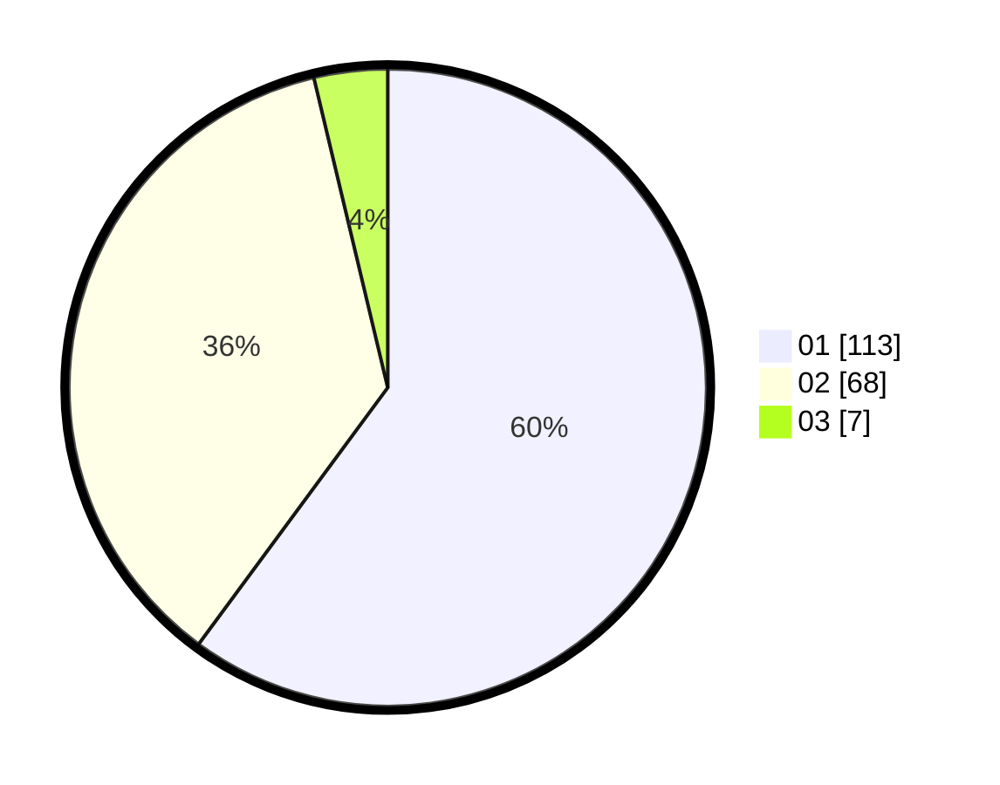

# Hasil

Hasil perolehan suara paslon dapat dilihat pada file paslon-01.txt, paslon-02.txt, dan paslon-03.txt.

Jika tidak ada, artinya data tersebut belum ada pada SIREKAP.

## Perolehan Suara

 * Paslon 01: **113**.
 * Paslon 02: **68**.
 * Paslon 03: **7**.

## Foto C Plano

https://sirekap-obj-formc.kpu.go.id/3d72/pemilu/ppwp/31/75/06/10/02/3175061002081-20240214-193021--3b048fde-af78-4e22-a6b5-5702091e9b90.jpg

https://sirekap-obj-formc.kpu.go.id/3d72/pemilu/ppwp/31/75/06/10/02/3175061002081-20240214-193649--3b5bf70d-a72e-412f-a99b-4ebf5a0894c7.jpg

https://sirekap-obj-formc.kpu.go.id/3d72/pemilu/ppwp/31/75/06/10/02/3175061002081-20240214-193921--7bc0157e-ec28-49d2-95da-4629e50da2ec.jpg

## DATA PEMILIH TETAP

Jumlah pemilih dalam DPT: **260**.
 * L: **137**.
 * P: **123**.

## DATA PENGGUNA HAK PILIH

Jumlah pengguna hak pilih dalam DPT: **190**.
 * L: **97**.
 * P: **93**.

Jumlah pengguna hak pilih dalam DPTb: **0**.
 * L: **0**.
 * P: **0**.

Jumlah pengguna hak pilih dalam DPK: **0**.
 * L: **0**.
 * P: **0**.

Jumlah pengguna hak pilih: **190**.
 * L: **97**.
 * P: **93**.

## JUMLAH SUARA SAH DAN TIDAK SAH

JUMLAH SELURUH SUARA SAH: **188**.

JUMLAH SUARA TIDAK SAH: **2**.

JUMLAH SELURUH SUARA SAH DAN SUARA TIDAK SAH: **190**.
