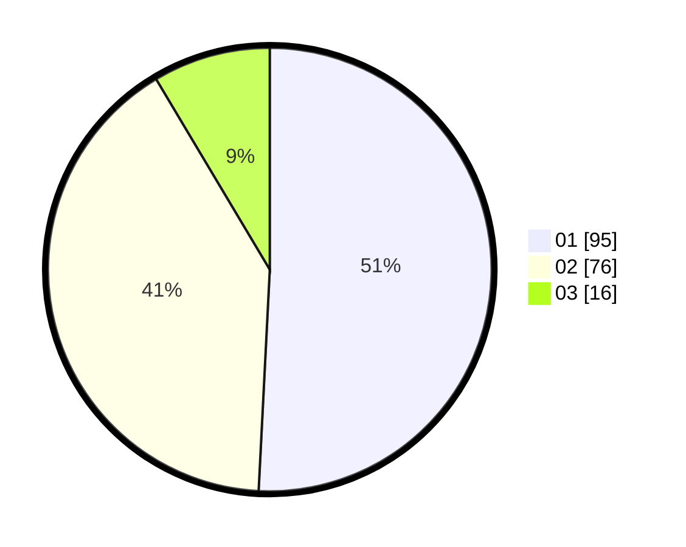

# Hasil

Hasil perolehan suara paslon dapat dilihat pada file paslon-01.txt, paslon-02.txt, dan paslon-03.txt.

Jika tidak ada, artinya data tersebut belum ada pada SIREKAP.

## Perolehan Suara

 * Paslon 01: **95**.
 * Paslon 02: **76**.
 * Paslon 03: **16**.

## Foto C Plano

https://sirekap-obj-formc.kpu.go.id/734f/pemilu/ppwp/31/75/06/10/02/3175061002082-20240215-010121--b0703d81-e4d3-4996-8fd7-b31ee759cbdc.jpg

https://sirekap-obj-formc.kpu.go.id/734f/pemilu/ppwp/31/75/06/10/02/3175061002082-20240215-010239--4fa344ea-b5be-4cf9-99f6-3b5156fbea3f.jpg

https://sirekap-obj-formc.kpu.go.id/734f/pemilu/ppwp/31/75/06/10/02/3175061002082-20240215-011135--7dcb367b-ffd9-4407-bee4-e91be120b65d.jpg
