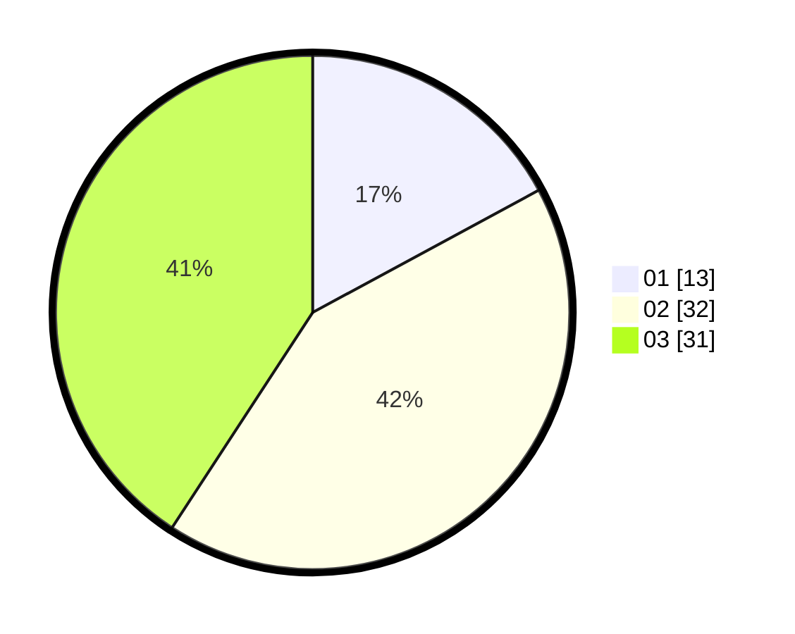

# Hasil

Hasil perolehan suara paslon dapat dilihat pada file paslon-01.txt, paslon-02.txt, dan paslon-03.txt.

Jika tidak ada, artinya data tersebut belum ada pada SIREKAP.

## Perolehan Suara

 * Paslon 01: **13**.
 * Paslon 02: **32**.
 * Paslon 03: **31**.

## Foto C Plano

https://sirekap-obj-formc.kpu.go.id/121c/pemilu/ppwp/31/75/06/10/02/3175061002901-20240216-190424--cd859f3f-8c87-44bd-a86d-1416571f82c5.jpg

https://sirekap-obj-formc.kpu.go.id/121c/pemilu/ppwp/31/75/06/10/02/3175061002901-20240216-190425--91c4c12a-b044-45e3-9b14-d687f83be9ed.jpg

https://sirekap-obj-formc.kpu.go.id/121c/pemilu/ppwp/31/75/06/10/02/3175061002901-20240216-190425--b7e57bee-23da-403a-8ecd-404f6c694e15.jpg

## DATA PEMILIH TETAP

Jumlah pemilih dalam DPT: **165**.
 * L: **80**.
 * P: **85**.

## DATA PENGGUNA HAK PILIH

Jumlah pengguna hak pilih dalam DPT: **65**.
 * L: **32**.
 * P: **33**.

Jumlah pengguna hak pilih dalam DPTb: **11**.
 * L: **7**.
 * P: **4**.

Jumlah pengguna hak pilih dalam DPK: **0**.
 * L: **0**.
 * P: **0**.

Jumlah pengguna hak pilih: **76**.
 * L: **39**.
 * P: **37**.

## JUMLAH SUARA SAH DAN TIDAK SAH

JUMLAH SELURUH SUARA SAH: **76**.

JUMLAH SUARA TIDAK SAH: **0**.

JUMLAH SELURUH SUARA SAH DAN SUARA TIDAK SAH: **76**.
