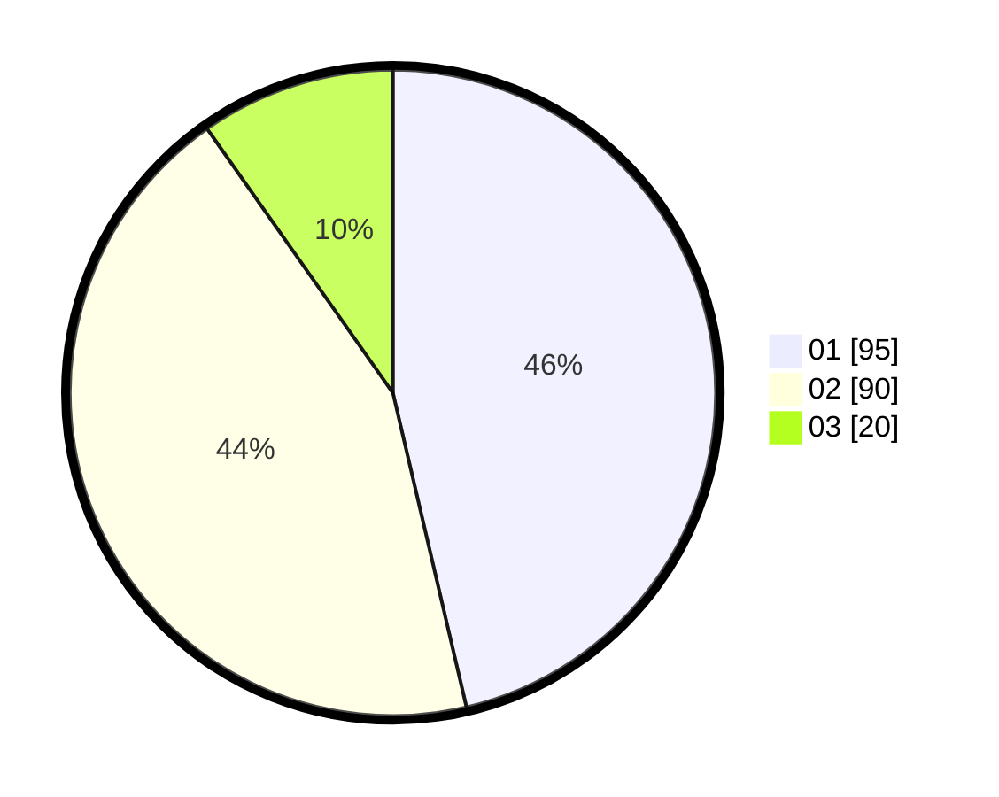

# Hasil

Hasil perolehan suara paslon dapat dilihat pada file paslon-01.txt, paslon-02.txt, dan paslon-03.txt.

Jika tidak ada, artinya data tersebut belum ada pada SIREKAP.

## Perolehan Suara

 * Paslon 01: **95**.
 * Paslon 02: **90**.
 * Paslon 03: **20**.

## Foto C Plano

https://sirekap-obj-formc.kpu.go.id/bdd0/pemilu/ppwp/31/75/06/10/03/3175061003003-20240214-211437--c4dd22ff-e4a6-4e00-a355-7e4abd3be98a.jpg

https://sirekap-obj-formc.kpu.go.id/bdd0/pemilu/ppwp/31/75/06/10/03/3175061003003-20240214-211251--46e4206b-02d4-445b-8ddc-5c3775d438dd.jpg

https://sirekap-obj-formc.kpu.go.id/bdd0/pemilu/ppwp/31/75/06/10/03/3175061003003-20240214-211740--fbcb1f6e-e07c-4ccf-baf3-c75e375810ad.jpg
