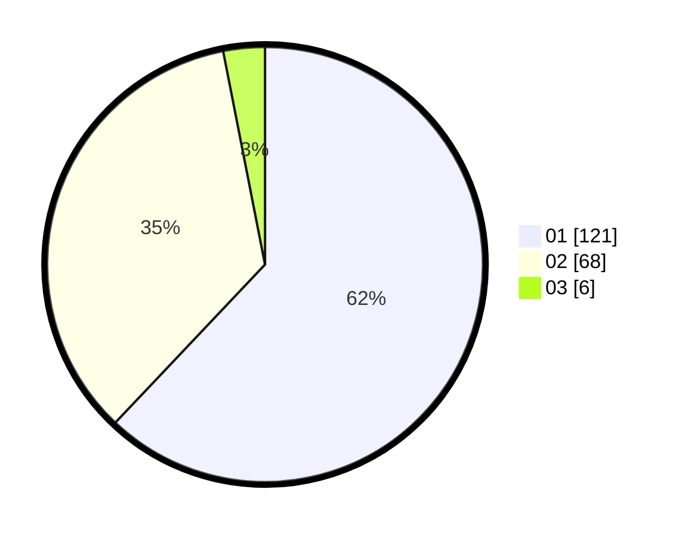

# Hasil

Hasil perolehan suara paslon dapat dilihat pada file paslon-01.txt, paslon-02.txt, dan paslon-03.txt.

Jika tidak ada, artinya data tersebut belum ada pada SIREKAP.

## Perolehan Suara

 * Paslon 01: **121**.
 * Paslon 02: **68**.
 * Paslon 03: **6**.

## Foto C Plano

https://sirekap-obj-formc.kpu.go.id/23f2/pemilu/ppwp/31/75/06/10/03/3175061003005-20240216-144900--ef843afd-9bf4-4542-af7f-403cc2752f17.jpg

https://sirekap-obj-formc.kpu.go.id/23f2/pemilu/ppwp/31/75/06/10/03/3175061003005-20240216-143550--a43bf419-d7e5-44ff-ac40-7005636a44ac.jpg

https://sirekap-obj-formc.kpu.go.id/23f2/pemilu/ppwp/31/75/06/10/03/3175061003005-20240216-143857--e9bc9928-ed83-472f-a00b-f2cb933e199f.jpg
