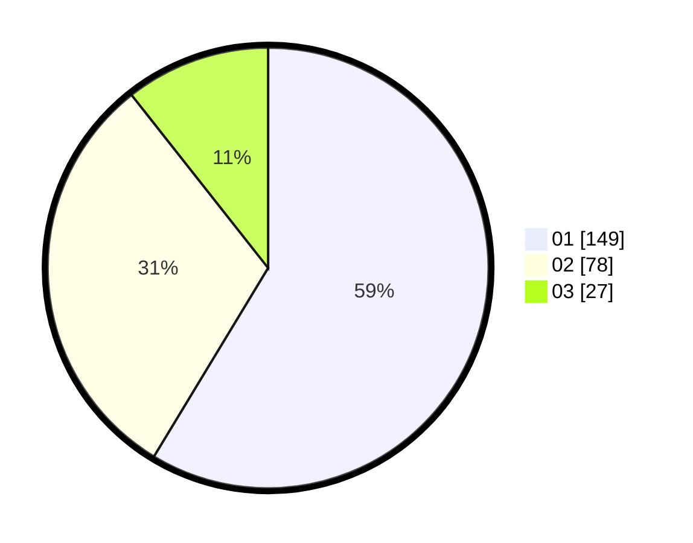

# Hasil

Hasil perolehan suara paslon dapat dilihat pada file paslon-01.txt, paslon-02.txt, dan paslon-03.txt.

Jika tidak ada, artinya data tersebut belum ada pada SIREKAP.

## Perolehan Suara

 * Paslon 01: **149**.
 * Paslon 02: **78**.
 * Paslon 03: **27**.

## Foto C Plano

https://sirekap-obj-formc.kpu.go.id/696e/pemilu/ppwp/31/75/06/10/03/3175061003019-20240216-212243--74f3fd34-7727-4461-b2c7-31304e4ed8b2.jpg

https://sirekap-obj-formc.kpu.go.id/696e/pemilu/ppwp/31/75/06/10/03/3175061003019-20240216-212245--11998a61-41f9-4869-857e-df9b46e4cca2.jpg

https://sirekap-obj-formc.kpu.go.id/696e/pemilu/ppwp/31/75/06/10/03/3175061003019-20240216-212244--cb7a6ca1-4a48-451f-b68d-d3831ab6f84e.jpg

## DATA PEMILIH TETAP

Jumlah pemilih dalam DPT: **294**.
 * L: **145**.
 * P: **149**.

## DATA PENGGUNA HAK PILIH

Jumlah pengguna hak pilih dalam DPT: **254**.
 * L: **122**.
 * P: **132**.

Jumlah pengguna hak pilih dalam DPTb: **0**.
 * L: **0**.
 * P: **0**.

Jumlah pengguna hak pilih dalam DPK: **1**.
 * L: **1**.
 * P: **0**.

Jumlah pengguna hak pilih: **255**.
 * L: **123**.
 * P: **132**.

## JUMLAH SUARA SAH DAN TIDAK SAH

JUMLAH SELURUH SUARA SAH: **254**.

JUMLAH SUARA TIDAK SAH: **1**.

JUMLAH SELURUH SUARA SAH DAN SUARA TIDAK SAH: **255**.
