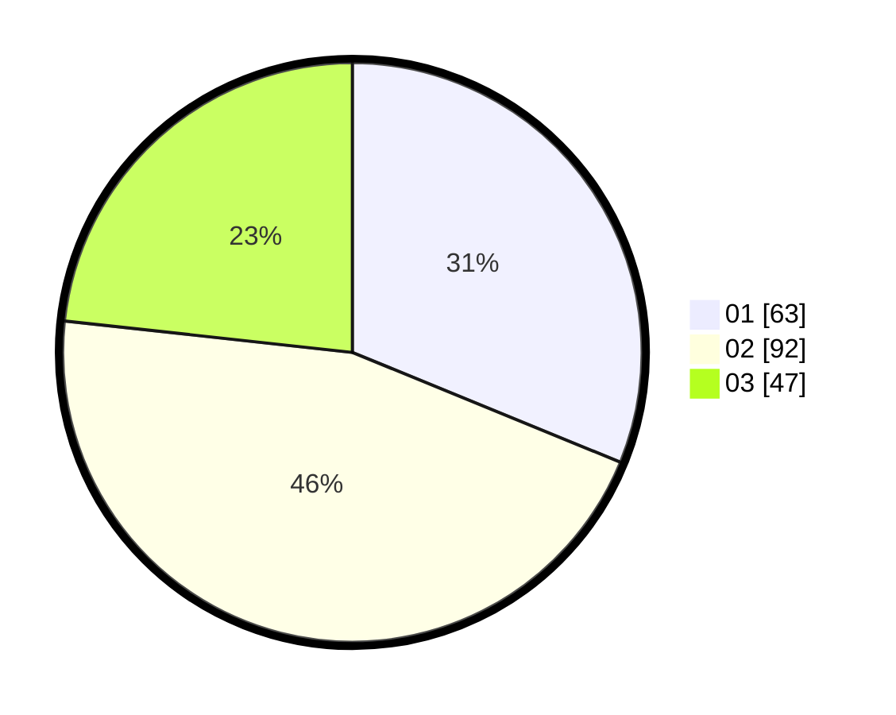

# Hasil

Hasil perolehan suara paslon dapat dilihat pada file paslon-01.txt, paslon-02.txt, dan paslon-03.txt.

Jika tidak ada, artinya data tersebut belum ada pada SIREKAP.

## Perolehan Suara

 * Paslon 01: **63**.
 * Paslon 02: **92**.
 * Paslon 03: **47**.

## Foto C Plano

https://sirekap-obj-formc.kpu.go.id/26cc/pemilu/ppwp/31/75/06/10/03/3175061003023-20240215-234324--de0fb798-3a23-49a3-80e7-4b68982e63b1.jpg

https://sirekap-obj-formc.kpu.go.id/26cc/pemilu/ppwp/31/75/06/10/03/3175061003023-20240215-234352--dfcb0903-c9ff-4736-a3c0-d994214c59f7.jpg
