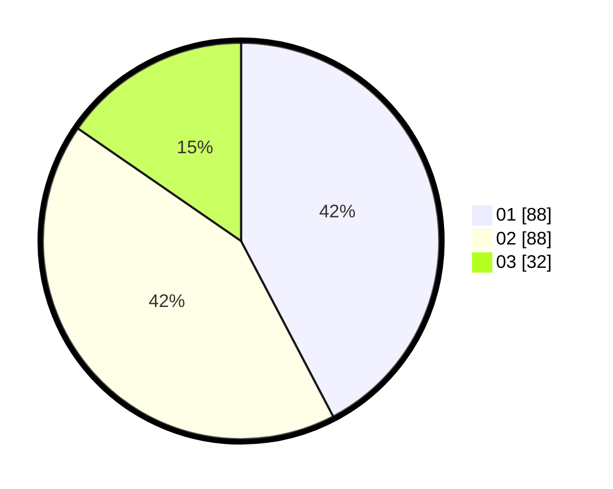

# Hasil

Hasil perolehan suara paslon dapat dilihat pada file paslon-01.txt, paslon-02.txt, dan paslon-03.txt.

Jika tidak ada, artinya data tersebut belum ada pada SIREKAP.

## Perolehan Suara

 * Paslon 01: **88**.
 * Paslon 02: **88**.
 * Paslon 03: **32**.

## Foto C Plano

https://sirekap-obj-formc.kpu.go.id/4a8a/pemilu/ppwp/31/75/06/10/03/3175061003027-20240214-233049--5ad7b02c-bf36-427a-86b9-37ccb594dd7c.jpg

https://sirekap-obj-formc.kpu.go.id/4a8a/pemilu/ppwp/31/75/06/10/03/3175061003027-20240214-233317--dda692cb-8be8-4280-8d35-d21ca4266607.jpg

https://sirekap-obj-formc.kpu.go.id/4a8a/pemilu/ppwp/31/75/06/10/03/3175061003027-20240214-233652--ae31000e-8683-459e-a062-a2ae8ecabc54.jpg

## DATA PEMILIH TETAP

Jumlah pemilih dalam DPT: **279**.
 * L: **145**.
 * P: **134**.

## DATA PENGGUNA HAK PILIH

Jumlah pengguna hak pilih dalam DPT: **211**.
 * L: **105**.
 * P: **106**.

Jumlah pengguna hak pilih dalam DPTb: **0**.
 * L: **0**.
 * P: **0**.

Jumlah pengguna hak pilih dalam DPK: **0**.
 * L: **0**.
 * P: **0**.

Jumlah pengguna hak pilih: **211**.
 * L: **105**.
 * P: **106**.

## JUMLAH SUARA SAH DAN TIDAK SAH

JUMLAH SELURUH SUARA SAH: **208**.

JUMLAH SUARA TIDAK SAH: **3**.

JUMLAH SELURUH SUARA SAH DAN SUARA TIDAK SAH: **211**.
