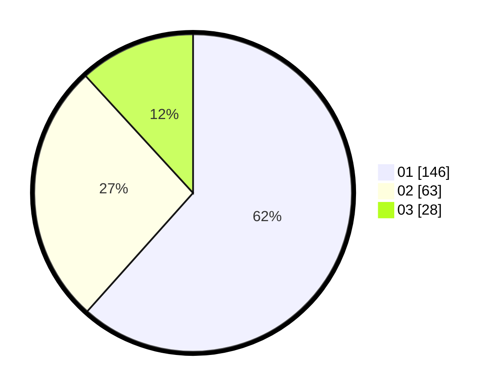

# Hasil

Hasil perolehan suara paslon dapat dilihat pada file paslon-01.txt, paslon-02.txt, dan paslon-03.txt.

Jika tidak ada, artinya data tersebut belum ada pada SIREKAP.

## Perolehan Suara

 * Paslon 01: **146**.
 * Paslon 02: **63**.
 * Paslon 03: **28**.

## Foto C Plano

https://sirekap-obj-formc.kpu.go.id/ca97/pemilu/ppwp/31/75/06/10/03/3175061003028-20240214-192703--56bed70b-905a-4015-a2d1-cf012a4b1e83.jpg

https://sirekap-obj-formc.kpu.go.id/ca97/pemilu/ppwp/31/75/06/10/03/3175061003028-20240215-223744--7dc23ff8-4cd2-49b8-b019-b42f3fb46723.jpg

https://sirekap-obj-formc.kpu.go.id/ca97/pemilu/ppwp/31/75/06/10/03/3175061003028-20240215-223743--341c9153-89d3-48ef-aee4-63bc146e5225.jpg

## DATA PEMILIH TETAP

Jumlah pemilih dalam DPT: **290**.
 * L: **138**.
 * P: **152**.

## DATA PENGGUNA HAK PILIH

Jumlah pengguna hak pilih dalam DPT: **224**.
 * L: **102**.
 * P: **122**.

Jumlah pengguna hak pilih dalam DPTb: **444**.
 * L: **404**.
 * P: **40**.

Jumlah pengguna hak pilih dalam DPK: **492**.
 * L: **0**.
 * P: **492**.

Jumlah pengguna hak pilih: **238**.
 * L: **178**.
 * P: **174**.

## JUMLAH SUARA SAH DAN TIDAK SAH

JUMLAH SELURUH SUARA SAH: **237**.

JUMLAH SUARA TIDAK SAH: **1**.

JUMLAH SELURUH SUARA SAH DAN SUARA TIDAK SAH: **238**.
