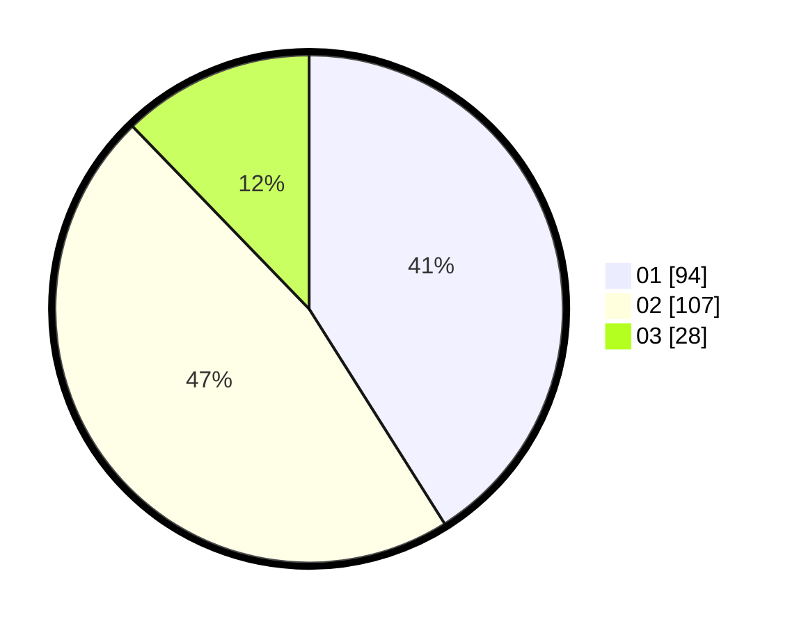

# Hasil

Hasil perolehan suara paslon dapat dilihat pada file paslon-01.txt, paslon-02.txt, dan paslon-03.txt.

Jika tidak ada, artinya data tersebut belum ada pada SIREKAP.

## Perolehan Suara

 * Paslon 01: **94**.
 * Paslon 02: **107**.
 * Paslon 03: **28**.

## Foto C Plano

https://sirekap-obj-formc.kpu.go.id/2219/pemilu/ppwp/31/75/06/10/03/3175061003030-20240217-212029--29731fd7-6e59-4335-b7bd-2cfbd00e965e.jpg

https://sirekap-obj-formc.kpu.go.id/2219/pemilu/ppwp/31/75/06/10/03/3175061003030-20240217-212050--780dbe86-e8af-4512-9908-82409c52c445.jpg

https://sirekap-obj-formc.kpu.go.id/2219/pemilu/ppwp/31/75/06/10/03/3175061003030-20240217-212208--caecc1e1-e1bd-4776-9ca3-caf68c7247c5.jpg
