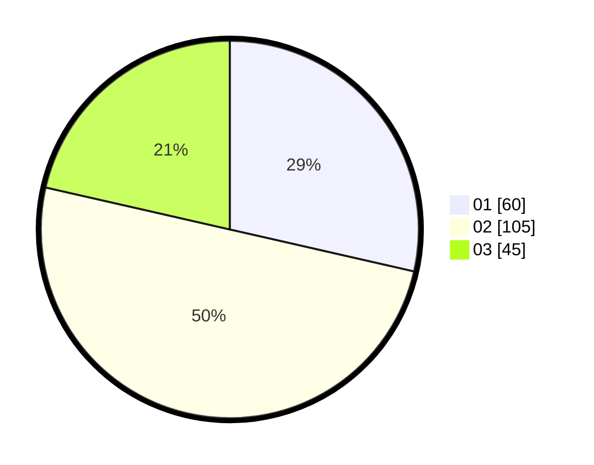

# Hasil

Hasil perolehan suara paslon dapat dilihat pada file paslon-01.txt, paslon-02.txt, dan paslon-03.txt.

Jika tidak ada, artinya data tersebut belum ada pada SIREKAP.

## Perolehan Suara

 * Paslon 01: **60**.
 * Paslon 02: **105**.
 * Paslon 03: **45**.

## Foto C Plano

https://sirekap-obj-formc.kpu.go.id/cf00/pemilu/ppwp/31/75/06/10/03/3175061003032-20240214-155827--2856019b-6c2d-4d59-bd4d-e7978c381c46.jpg

https://sirekap-obj-formc.kpu.go.id/cf00/pemilu/ppwp/31/75/06/10/03/3175061003032-20240215-002146--4c6301c8-fefe-4482-a709-3126fe63cf45.jpg

https://sirekap-obj-formc.kpu.go.id/cf00/pemilu/ppwp/31/75/06/10/03/3175061003032-20240215-002305--585a70dd-0435-4d17-8381-4194d95ae00a.jpg
