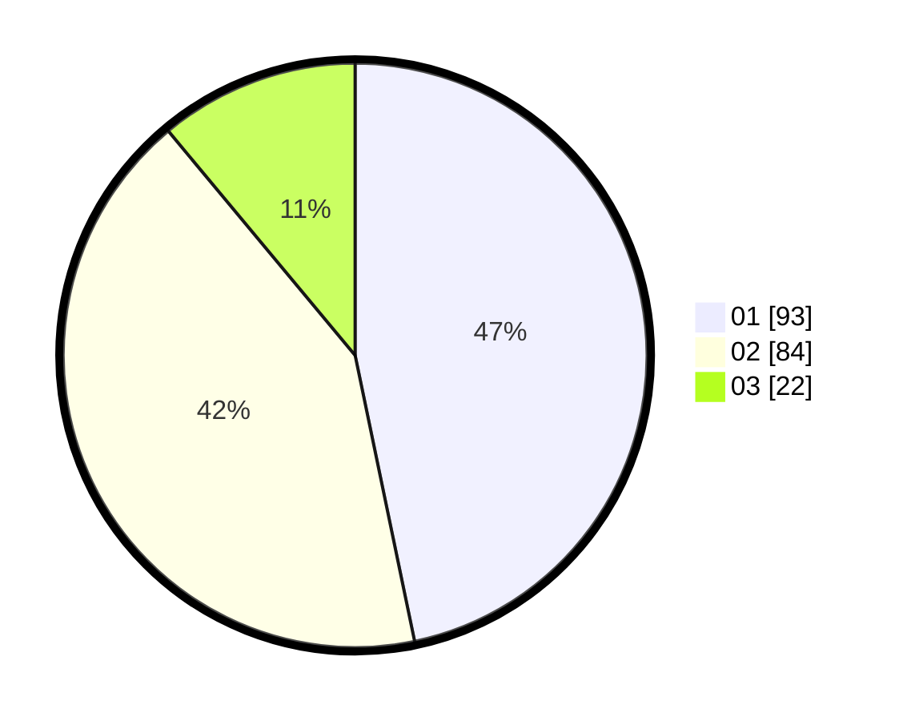

# Hasil

Hasil perolehan suara paslon dapat dilihat pada file paslon-01.txt, paslon-02.txt, dan paslon-03.txt.

Jika tidak ada, artinya data tersebut belum ada pada SIREKAP.

## Perolehan Suara

 * Paslon 01: **93**.
 * Paslon 02: **84**.
 * Paslon 03: **22**.

## Foto C Plano

https://sirekap-obj-formc.kpu.go.id/888d/pemilu/ppwp/31/75/06/10/03/3175061003034-20240214-202814--8775818c-1d80-4ecf-a967-0d24247c7d82.jpg

https://sirekap-obj-formc.kpu.go.id/888d/pemilu/ppwp/31/75/06/10/03/3175061003034-20240214-202918--f95edb88-f1a0-4277-8f37-21f64ccc0c37.jpg

https://sirekap-obj-formc.kpu.go.id/888d/pemilu/ppwp/31/75/06/10/03/3175061003034-20240214-202957--c30c0117-8a8d-4ca3-ba65-7bb09246cecb.jpg
