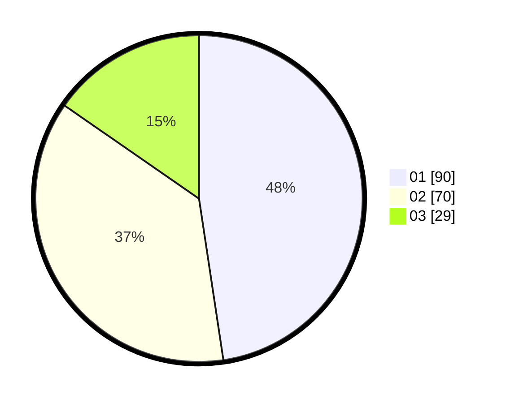

# Hasil

Hasil perolehan suara paslon dapat dilihat pada file paslon-01.txt, paslon-02.txt, dan paslon-03.txt.

Jika tidak ada, artinya data tersebut belum ada pada SIREKAP.

## Perolehan Suara

 * Paslon 01: **90**.
 * Paslon 02: **70**.
 * Paslon 03: **29**.

## Foto C Plano

https://sirekap-obj-formc.kpu.go.id/4fe5/pemilu/ppwp/31/75/06/10/03/3175061003035-20240214-204921--da468147-a953-43a1-bae5-70d09d54ad75.jpg

https://sirekap-obj-formc.kpu.go.id/4fe5/pemilu/ppwp/31/75/06/10/03/3175061003035-20240214-205059--a5c6d5db-822d-4f1f-8c58-298c28875db0.jpg

https://sirekap-obj-formc.kpu.go.id/4fe5/pemilu/ppwp/31/75/06/10/03/3175061003035-20240214-205227--65f8097d-0b28-4cf7-a1a6-5aa2dbd0823e.jpg

## DATA PEMILIH TETAP

Jumlah pemilih dalam DPT: **258**.
 * L: **131**.
 * P: **127**.

## DATA PENGGUNA HAK PILIH

Jumlah pengguna hak pilih dalam DPT: **188**.
 * L: **290**.
 * P: **91**.

Jumlah pengguna hak pilih dalam DPTb: **440**.
 * L: **202**.
 * P: **4**.

Jumlah pengguna hak pilih dalam DPK: **2**.
 * L: **1**.
 * P: **1**.

Jumlah pengguna hak pilih: **191**.
 * L: **4**.
 * P: **20**.

## JUMLAH SUARA SAH DAN TIDAK SAH

JUMLAH SELURUH SUARA SAH: **189**.

JUMLAH SUARA TIDAK SAH: **2**.

JUMLAH SELURUH SUARA SAH DAN SUARA TIDAK SAH: **191**.
