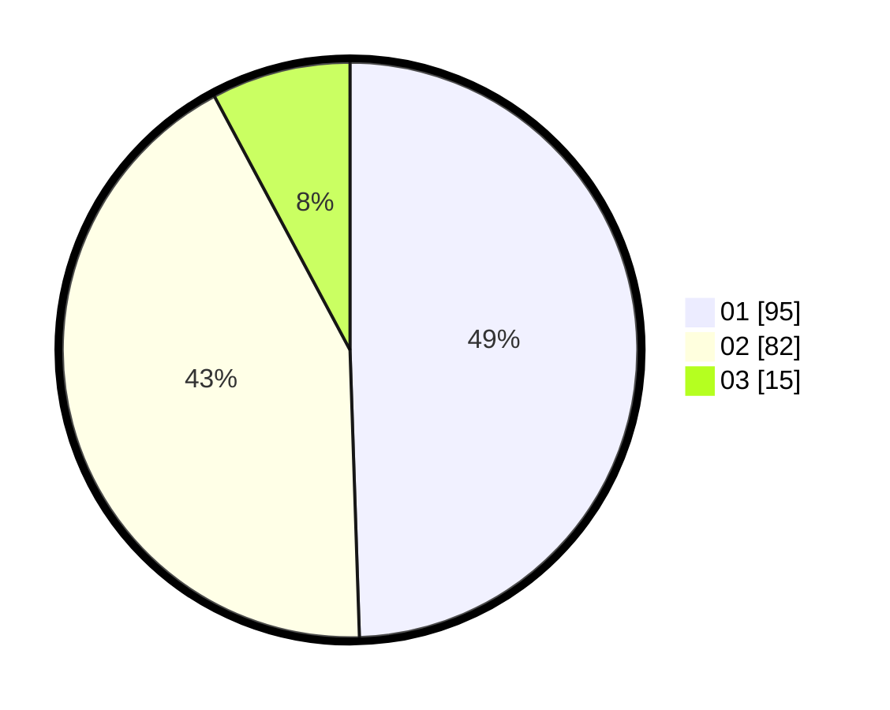

# Hasil

Hasil perolehan suara paslon dapat dilihat pada file paslon-01.txt, paslon-02.txt, dan paslon-03.txt.

Jika tidak ada, artinya data tersebut belum ada pada SIREKAP.

## Perolehan Suara

 * Paslon 01: **95**.
 * Paslon 02: **82**.
 * Paslon 03: **15**.

## Foto C Plano

https://sirekap-obj-formc.kpu.go.id/90db/pemilu/ppwp/31/75/06/10/03/3175061003036-20240214-205548--fcd20939-2258-4533-b8c1-d7ca9cce607d.jpg

https://sirekap-obj-formc.kpu.go.id/90db/pemilu/ppwp/31/75/06/10/03/3175061003036-20240214-205924--2ce87135-b9d2-45cb-97bd-8221726935f2.jpg

https://sirekap-obj-formc.kpu.go.id/90db/pemilu/ppwp/31/75/06/10/03/3175061003036-20240214-210331--442bd769-b33c-4a57-9f3c-2961a5fa7533.jpg
