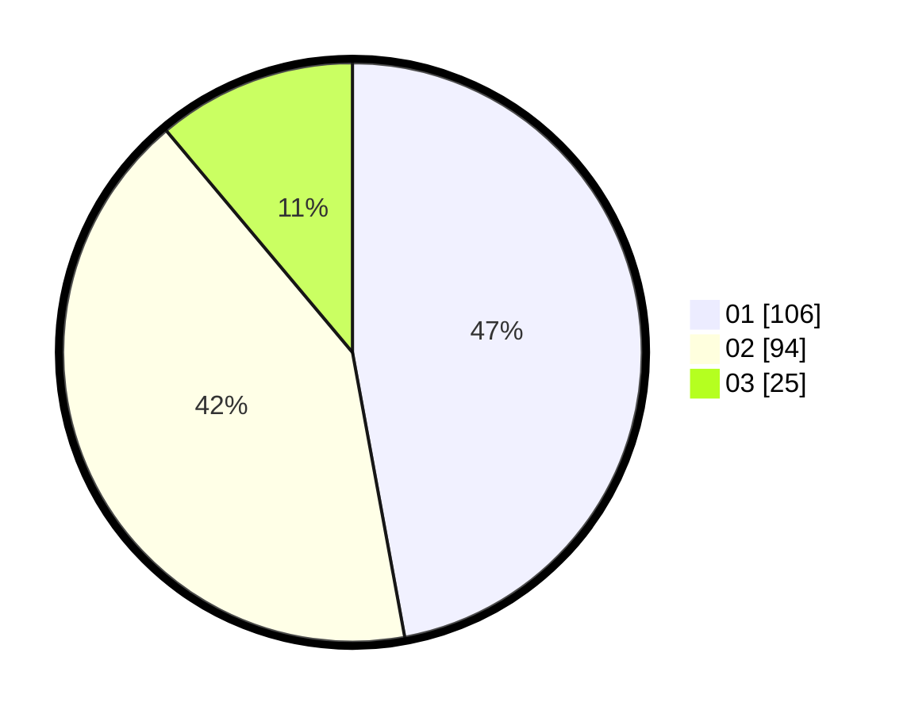

# Hasil

Hasil perolehan suara paslon dapat dilihat pada file paslon-01.txt, paslon-02.txt, dan paslon-03.txt.

Jika tidak ada, artinya data tersebut belum ada pada SIREKAP.

## Perolehan Suara

 * Paslon 01: **106**.
 * Paslon 02: **94**.
 * Paslon 03: **25**.

## Foto C Plano

https://sirekap-obj-formc.kpu.go.id/6132/pemilu/ppwp/31/75/06/10/03/3175061003037-20240215-015524--76b249f6-c0c8-42eb-94f9-e795a2a956dc.jpg

https://sirekap-obj-formc.kpu.go.id/6132/pemilu/ppwp/31/75/06/10/03/3175061003037-20240215-015530--e391c643-78f2-47ec-acb5-ee4399e1ffe1.jpg

https://sirekap-obj-formc.kpu.go.id/6132/pemilu/ppwp/31/75/06/10/03/3175061003037-20240215-015542--04288d7d-fca2-418d-b03d-68542fe5f1aa.jpg

## DATA PEMILIH TETAP

Jumlah pemilih dalam DPT: **274**.
 * L: **130**.
 * P: **144**.

## DATA PENGGUNA HAK PILIH

Jumlah pengguna hak pilih dalam DPT: **225**.
 * L: **108**.
 * P: **117**.

Jumlah pengguna hak pilih dalam DPTb: **1**.
 * L: **1**.
 * P: **0**.

Jumlah pengguna hak pilih dalam DPK: **0**.
 * L: **0**.
 * P: **0**.

Jumlah pengguna hak pilih: **226**.
 * L: **109**.
 * P: **117**.

## JUMLAH SUARA SAH DAN TIDAK SAH

JUMLAH SELURUH SUARA SAH: **225**.

JUMLAH SUARA TIDAK SAH: **1**.

JUMLAH SELURUH SUARA SAH DAN SUARA TIDAK SAH: **226**.
