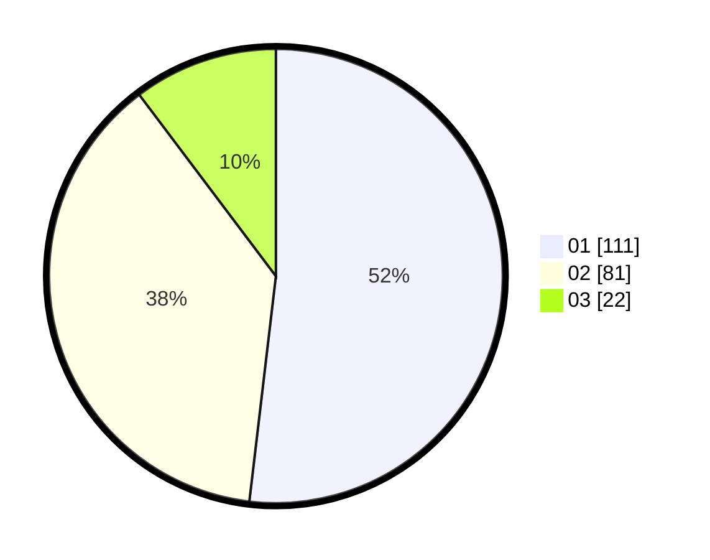

# Hasil

Hasil perolehan suara paslon dapat dilihat pada file paslon-01.txt, paslon-02.txt, dan paslon-03.txt.

Jika tidak ada, artinya data tersebut belum ada pada SIREKAP.

## Perolehan Suara

 * Paslon 01: **111**.
 * Paslon 02: **81**.
 * Paslon 03: **22**.

## Foto C Plano

https://sirekap-obj-formc.kpu.go.id/639a/pemilu/ppwp/31/75/06/10/03/3175061003039-20240216-135633--b66e6125-1151-4d59-9dcd-d8cc285d6af2.jpg

https://sirekap-obj-formc.kpu.go.id/639a/pemilu/ppwp/31/75/06/10/03/3175061003039-20240216-135634--7a5608e6-de67-4046-a9f6-fa3635daa489.jpg

https://sirekap-obj-formc.kpu.go.id/639a/pemilu/ppwp/31/75/06/10/03/3175061003039-20240216-135633--3eb60814-93aa-48db-bf2b-f1cd6f981290.jpg

## DATA PEMILIH TETAP

Jumlah pemilih dalam DPT: **278**.
 * L: **152**.
 * P: **126**.

## DATA PENGGUNA HAK PILIH

Jumlah pengguna hak pilih dalam DPT: **216**.
 * L: **111**.
 * P: **105**.

Jumlah pengguna hak pilih dalam DPTb: **0**.
 * L: **0**.
 * P: **0**.

Jumlah pengguna hak pilih dalam DPK: **1**.
 * L: **0**.
 * P: **1**.

Jumlah pengguna hak pilih: **217**.
 * L: **111**.
 * P: **106**.

## JUMLAH SUARA SAH DAN TIDAK SAH

JUMLAH SELURUH SUARA SAH: **214**.

JUMLAH SUARA TIDAK SAH: **3**.

JUMLAH SELURUH SUARA SAH DAN SUARA TIDAK SAH: **217**.
