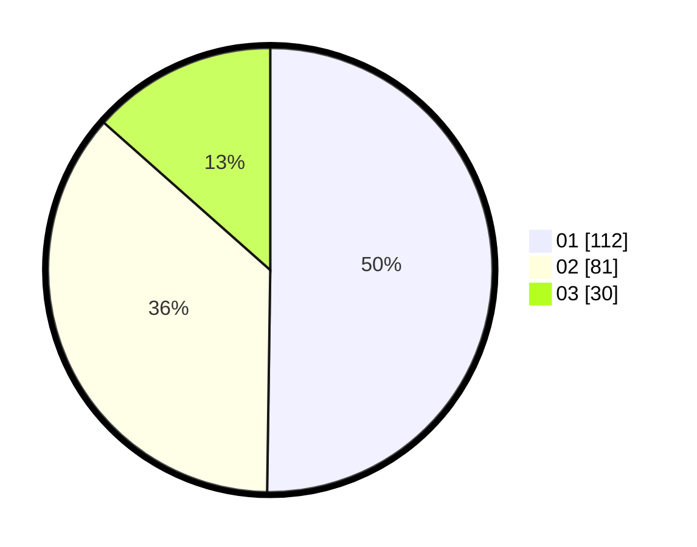

# Hasil

Hasil perolehan suara paslon dapat dilihat pada file paslon-01.txt, paslon-02.txt, dan paslon-03.txt.

Jika tidak ada, artinya data tersebut belum ada pada SIREKAP.

## Perolehan Suara

 * Paslon 01: **112**.
 * Paslon 02: **81**.
 * Paslon 03: **30**.

## Foto C Plano

https://sirekap-obj-formc.kpu.go.id/e90d/pemilu/ppwp/31/75/06/10/03/3175061003042-20240215-022208--016abf21-c956-4b16-ba0c-7f19fd065324.jpg

https://sirekap-obj-formc.kpu.go.id/e90d/pemilu/ppwp/31/75/06/10/03/3175061003042-20240214-221440--8c0ef775-8d25-4047-ac31-ff48e2063397.jpg

https://sirekap-obj-formc.kpu.go.id/e90d/pemilu/ppwp/31/75/06/10/03/3175061003042-20240214-221627--9d26ee1f-69d4-49ef-bee5-a47ce0e0f559.jpg
