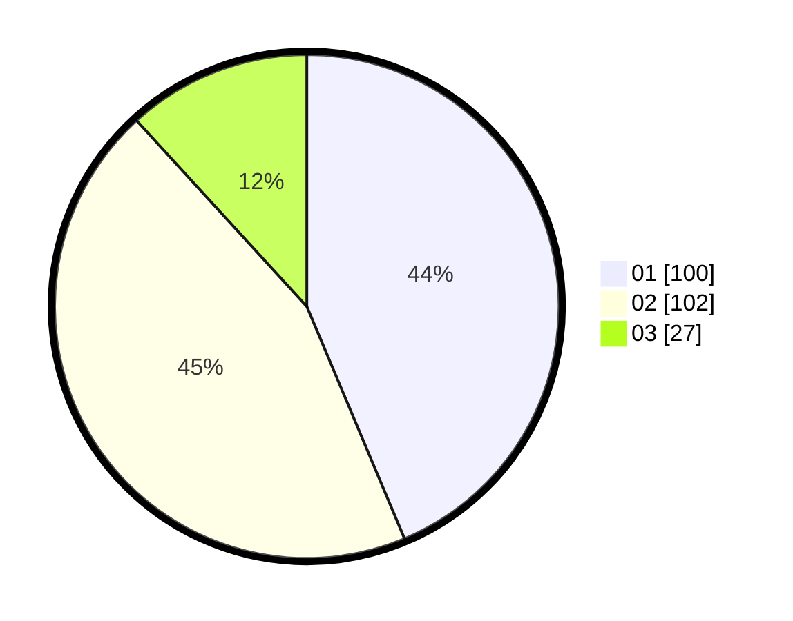

# Hasil

Hasil perolehan suara paslon dapat dilihat pada file paslon-01.txt, paslon-02.txt, dan paslon-03.txt.

Jika tidak ada, artinya data tersebut belum ada pada SIREKAP.

## Perolehan Suara

 * Paslon 01: **100**.
 * Paslon 02: **102**.
 * Paslon 03: **27**.

## Foto C Plano

https://sirekap-obj-formc.kpu.go.id/558a/pemilu/ppwp/31/75/06/10/03/3175061003043-20240214-192414--5f405531-bc8c-4827-9fe2-06ef5f7c555c.jpg

https://sirekap-obj-formc.kpu.go.id/558a/pemilu/ppwp/31/75/06/10/03/3175061003043-20240214-155811--1fabcbb5-ee5d-48a3-90a3-e95da6e9dd64.jpg

https://sirekap-obj-formc.kpu.go.id/558a/pemilu/ppwp/31/75/06/10/03/3175061003043-20240214-160057--fb1c313a-61ee-4c86-aab0-64f1fc3b03ef.jpg

## DATA PEMILIH TETAP

Jumlah pemilih dalam DPT: **299**.
 * L: **154**.
 * P: **145**.

## DATA PENGGUNA HAK PILIH

Jumlah pengguna hak pilih dalam DPT: **230**.
 * L: **114**.
 * P: **116**.

Jumlah pengguna hak pilih dalam DPTb: **0**.
 * L: **1**.
 * P: **0**.

Jumlah pengguna hak pilih dalam DPK: **0**.
 * L: **0**.
 * P: **0**.

Jumlah pengguna hak pilih: **231**.
 * L: **115**.
 * P: **116**.

## JUMLAH SUARA SAH DAN TIDAK SAH

JUMLAH SELURUH SUARA SAH: **229**.

JUMLAH SUARA TIDAK SAH: **2**.

JUMLAH SELURUH SUARA SAH DAN SUARA TIDAK SAH: **231**.
