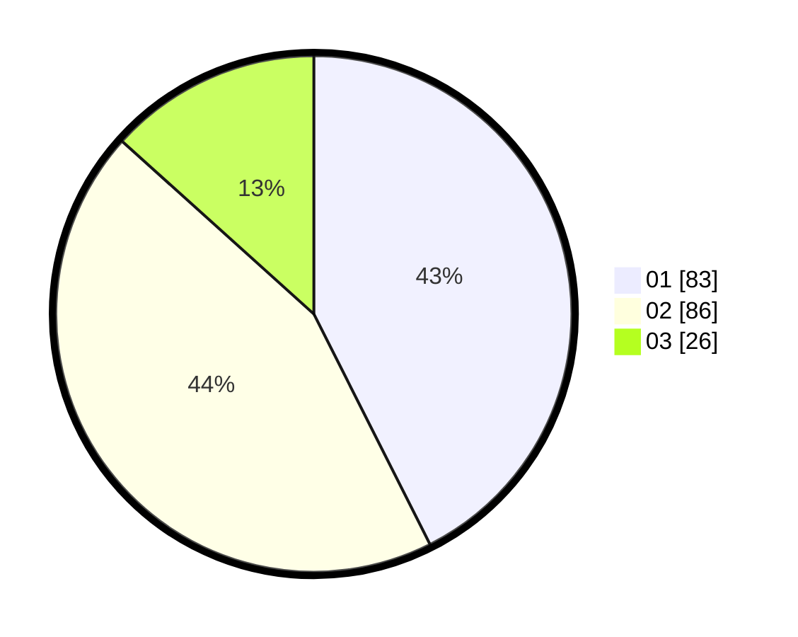

# Hasil

Hasil perolehan suara paslon dapat dilihat pada file paslon-01.txt, paslon-02.txt, dan paslon-03.txt.

Jika tidak ada, artinya data tersebut belum ada pada SIREKAP.

## Perolehan Suara

 * Paslon 01: **83**.
 * Paslon 02: **86**.
 * Paslon 03: **26**.

## Foto C Plano

https://sirekap-obj-formc.kpu.go.id/39ec/pemilu/ppwp/31/75/06/10/03/3175061003044-20240216-042248--d9896f3d-04b9-4918-8451-c5f4d30d05cc.jpg

https://sirekap-obj-formc.kpu.go.id/39ec/pemilu/ppwp/31/75/06/10/03/3175061003044-20240214-204622--b997e958-21e9-4780-9531-9e65a148baea.jpg

https://sirekap-obj-formc.kpu.go.id/39ec/pemilu/ppwp/31/75/06/10/03/3175061003044-20240214-204703--6bd43ea5-0d32-4f0a-bed1-16182dbdfadd.jpg

## DATA PEMILIH TETAP

Jumlah pemilih dalam DPT: **269**.
 * L: **140**.
 * P: **129**.

## DATA PENGGUNA HAK PILIH

Jumlah pengguna hak pilih dalam DPT: **194**.
 * L: **94**.
 * P: **100**.

Jumlah pengguna hak pilih dalam DPTb: **0**.
 * L: **0**.
 * P: **0**.

Jumlah pengguna hak pilih dalam DPK: **1**.
 * L: **1**.
 * P: **0**.

Jumlah pengguna hak pilih: **195**.
 * L: **95**.
 * P: **100**.

## JUMLAH SUARA SAH DAN TIDAK SAH

JUMLAH SELURUH SUARA SAH: **195**.

JUMLAH SUARA TIDAK SAH: **0**.

JUMLAH SELURUH SUARA SAH DAN SUARA TIDAK SAH: **195**.
