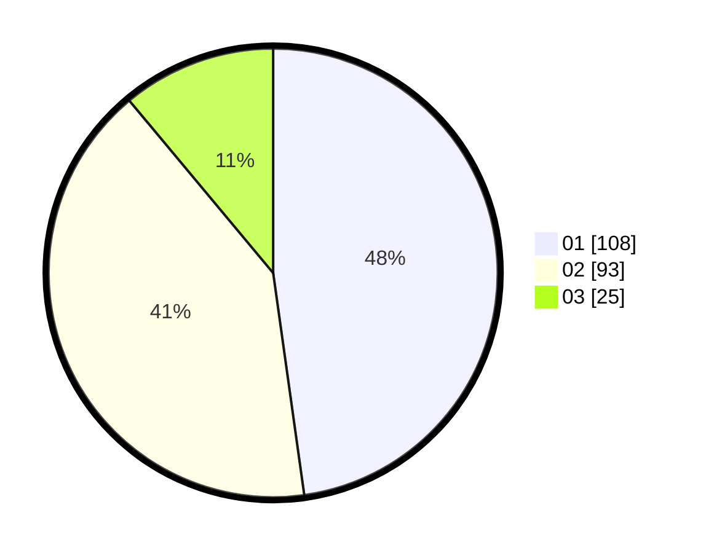

# Hasil

Hasil perolehan suara paslon dapat dilihat pada file paslon-01.txt, paslon-02.txt, dan paslon-03.txt.

Jika tidak ada, artinya data tersebut belum ada pada SIREKAP.

## Perolehan Suara

 * Paslon 01: **108**.
 * Paslon 02: **93**.
 * Paslon 03: **25**.

## Foto C Plano

https://sirekap-obj-formc.kpu.go.id/8d81/pemilu/ppwp/31/75/06/10/03/3175061003047-20240214-193958--1695723f-1ffa-46e3-b5ae-58cc2226282f.jpg

https://sirekap-obj-formc.kpu.go.id/8d81/pemilu/ppwp/31/75/06/10/03/3175061003047-20240214-194020--c0f9ae7f-110d-4946-bda7-dbf0ff4a308f.jpg

https://sirekap-obj-formc.kpu.go.id/8d81/pemilu/ppwp/31/75/06/10/03/3175061003047-20240214-194042--8fd6898d-db20-4d70-9389-b63c5ccf1c5e.jpg

## DATA PEMILIH TETAP

Jumlah pemilih dalam DPT: **273**.
 * L: **132**.
 * P: **141**.

## DATA PENGGUNA HAK PILIH

Jumlah pengguna hak pilih dalam DPT: **223**.
 * L: **105**.
 * P: **118**.

Jumlah pengguna hak pilih dalam DPTb: **1**.
 * L: **0**.
 * P: **1**.

Jumlah pengguna hak pilih dalam DPK: **3**.
 * L: **0**.
 * P: **3**.

Jumlah pengguna hak pilih: **227**.
 * L: **105**.
 * P: **122**.

## JUMLAH SUARA SAH DAN TIDAK SAH

JUMLAH SELURUH SUARA SAH: **226**.

JUMLAH SUARA TIDAK SAH: **1**.

JUMLAH SELURUH SUARA SAH DAN SUARA TIDAK SAH: **227**.
