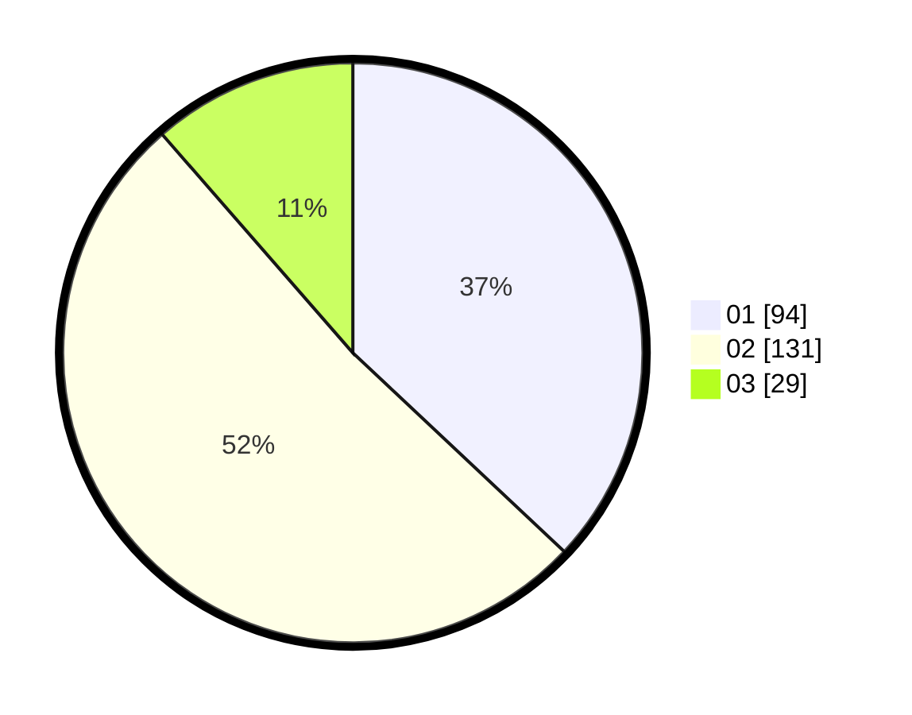

# Hasil

Hasil perolehan suara paslon dapat dilihat pada file paslon-01.txt, paslon-02.txt, dan paslon-03.txt.

Jika tidak ada, artinya data tersebut belum ada pada SIREKAP.

## Perolehan Suara

 * Paslon 01: **94**.
 * Paslon 02: **131**.
 * Paslon 03: **29**.

## Foto C Plano

https://sirekap-obj-formc.kpu.go.id/037e/pemilu/ppwp/31/75/06/10/03/3175061003062-20240216-133256--259651f4-8147-43dd-8a6d-985bb3ea5182.jpg

https://sirekap-obj-formc.kpu.go.id/037e/pemilu/ppwp/31/75/06/10/03/3175061003062-20240216-133257--f82b72ae-f8da-4596-a5f2-cf932b3b7138.jpg

https://sirekap-obj-formc.kpu.go.id/037e/pemilu/ppwp/31/75/06/10/03/3175061003062-20240214-162235--877674fe-3007-4e6e-9ded-10fbcd74f1e4.jpg

## DATA PEMILIH TETAP

Jumlah pemilih dalam DPT: **283**.
 * L: **133**.
 * P: **150**.

## DATA PENGGUNA HAK PILIH

Jumlah pengguna hak pilih dalam DPT: **242**.
 * L: **107**.
 * P: **135**.

Jumlah pengguna hak pilih dalam DPTb: **0**.
 * L: **0**.
 * P: **0**.

Jumlah pengguna hak pilih dalam DPK: **13**.
 * L: **2**.
 * P: **11**.

Jumlah pengguna hak pilih: **255**.
 * L: **109**.
 * P: **146**.

## JUMLAH SUARA SAH DAN TIDAK SAH

JUMLAH SELURUH SUARA SAH: **254**.

JUMLAH SUARA TIDAK SAH: **1**.

JUMLAH SELURUH SUARA SAH DAN SUARA TIDAK SAH: **255**.
