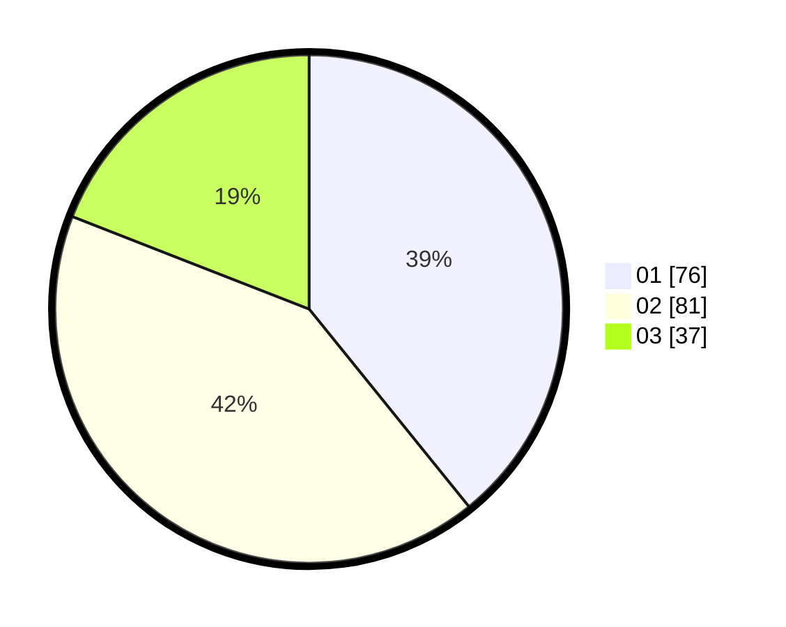

# Hasil

Hasil perolehan suara paslon dapat dilihat pada file paslon-01.txt, paslon-02.txt, dan paslon-03.txt.

Jika tidak ada, artinya data tersebut belum ada pada SIREKAP.

## Perolehan Suara

 * Paslon 01: **76**.
 * Paslon 02: **81**.
 * Paslon 03: **37**.

## Foto C Plano

https://sirekap-obj-formc.kpu.go.id/6e29/pemilu/ppwp/31/75/06/10/03/3175061003072-20240214-233534--3861ad30-c4b4-48d0-86d6-805adb3d006f.jpg

https://sirekap-obj-formc.kpu.go.id/6e29/pemilu/ppwp/31/75/06/10/03/3175061003072-20240214-233621--7aab7b15-280a-4b61-9554-e105ea182966.jpg

https://sirekap-obj-formc.kpu.go.id/6e29/pemilu/ppwp/31/75/06/10/03/3175061003072-20240214-233743--6999f657-034d-4c88-b0c3-d94733f712b0.jpg
