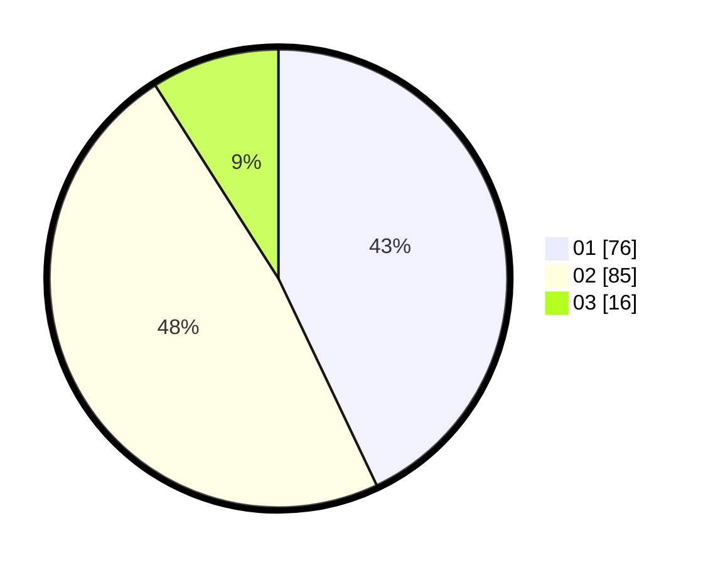

# Hasil

Hasil perolehan suara paslon dapat dilihat pada file paslon-01.txt, paslon-02.txt, dan paslon-03.txt.

Jika tidak ada, artinya data tersebut belum ada pada SIREKAP.

## Perolehan Suara

 * Paslon 01: **76**.
 * Paslon 02: **85**.
 * Paslon 03: **16**.

## Foto C Plano

https://sirekap-obj-formc.kpu.go.id/6d5c/pemilu/ppwp/31/75/06/10/03/3175061003073-20240214-185412--95606c3f-3fe2-4d55-9ce0-7445aa362fa3.jpg

https://sirekap-obj-formc.kpu.go.id/6d5c/pemilu/ppwp/31/75/06/10/03/3175061003073-20240214-185847--c43d3b8d-c5ca-4bba-82cf-d9435e224077.jpg

https://sirekap-obj-formc.kpu.go.id/6d5c/pemilu/ppwp/31/75/06/10/03/3175061003073-20240214-185706--35ce317a-7515-4bc0-bff4-4110890d94bf.jpg

## DATA PEMILIH TETAP

Jumlah pemilih dalam DPT: **253**.
 * L: **121**.
 * P: **132**.

## DATA PENGGUNA HAK PILIH

Jumlah pengguna hak pilih dalam DPT: **174**.
 * L: **80**.
 * P: **94**.

Jumlah pengguna hak pilih dalam DPTb: **3**.
 * L: **0**.
 * P: **3**.

Jumlah pengguna hak pilih dalam DPK: **3**.
 * L: **2**.
 * P: **1**.

Jumlah pengguna hak pilih: **180**.
 * L: **82**.
 * P: **98**.

## JUMLAH SUARA SAH DAN TIDAK SAH

JUMLAH SELURUH SUARA SAH: **177**.

JUMLAH SUARA TIDAK SAH: **3**.

JUMLAH SELURUH SUARA SAH DAN SUARA TIDAK SAH: **180**.
