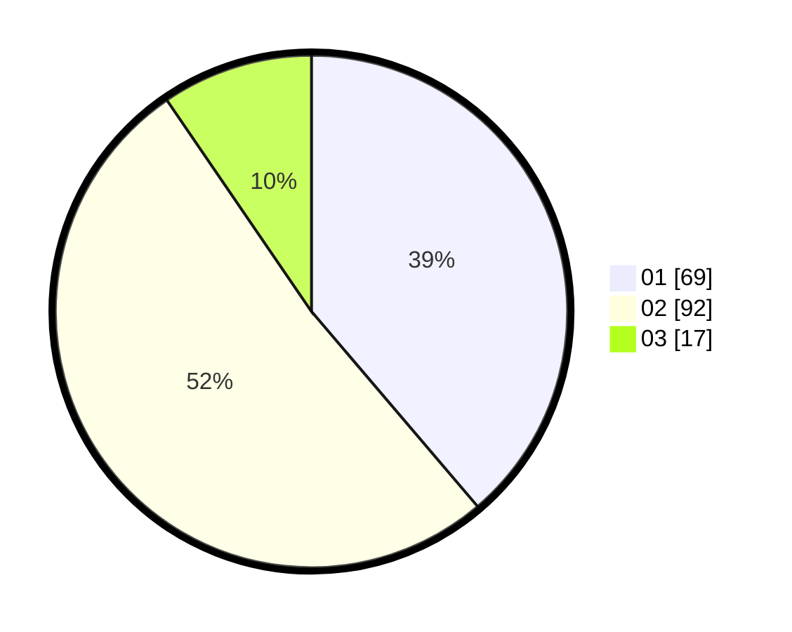

# Hasil

Hasil perolehan suara paslon dapat dilihat pada file paslon-01.txt, paslon-02.txt, dan paslon-03.txt.

Jika tidak ada, artinya data tersebut belum ada pada SIREKAP.

## Perolehan Suara

 * Paslon 01: **69**.
 * Paslon 02: **92**.
 * Paslon 03: **17**.

## Foto C Plano

https://sirekap-obj-formc.kpu.go.id/3bcc/pemilu/ppwp/31/75/06/10/03/3175061003074-20240215-173923--ae0fdc86-75fa-4bcb-9d14-d50a0ea962fe.jpg

https://sirekap-obj-formc.kpu.go.id/3bcc/pemilu/ppwp/31/75/06/10/03/3175061003074-20240215-174019--6c8d9a1e-6db4-400e-be20-778d4d51f806.jpg

https://sirekap-obj-formc.kpu.go.id/3bcc/pemilu/ppwp/31/75/06/10/03/3175061003074-20240215-174215--99e4725f-0791-4e99-9e72-f7ad5da8d18f.jpg
