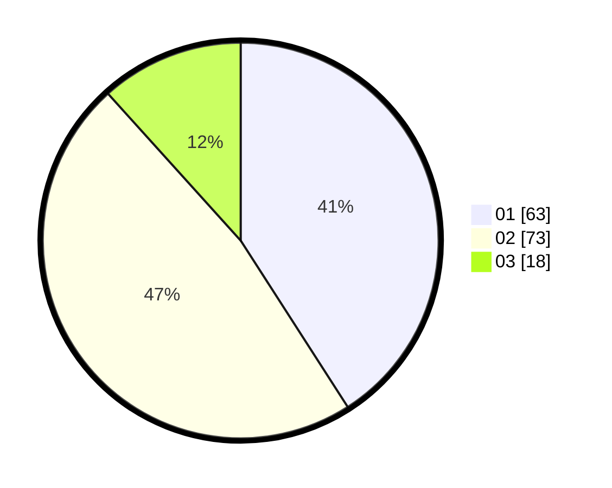

# Hasil

Hasil perolehan suara paslon dapat dilihat pada file paslon-01.txt, paslon-02.txt, dan paslon-03.txt.

Jika tidak ada, artinya data tersebut belum ada pada SIREKAP.

## Perolehan Suara

 * Paslon 01: **63**.
 * Paslon 02: **73**.
 * Paslon 03: **18**.

## Foto C Plano

https://sirekap-obj-formc.kpu.go.id/4bfd/pemilu/ppwp/31/75/06/10/03/3175061003083-20240216-221126--fafbf628-91e1-473f-a13d-ad7725a559a2.jpg

https://sirekap-obj-formc.kpu.go.id/4bfd/pemilu/ppwp/31/75/06/10/03/3175061003083-20240216-221127--385fb3f9-6f78-4afd-9fad-3763adb6a33f.jpg

https://sirekap-obj-formc.kpu.go.id/4bfd/pemilu/ppwp/31/75/06/10/03/3175061003083-20240216-221126--cf897b85-520c-4d93-8c43-3093a74a4f37.jpg

## DATA PEMILIH TETAP

Jumlah pemilih dalam DPT: **242**.
 * L: **127**.
 * P: **115**.

## DATA PENGGUNA HAK PILIH

Jumlah pengguna hak pilih dalam DPT: **158**.
 * L: **74**.
 * P: **84**.

Jumlah pengguna hak pilih dalam DPTb: **0**.
 * L: **0**.
 * P: **0**.

Jumlah pengguna hak pilih dalam DPK: **0**.
 * L: **0**.
 * P: **0**.

Jumlah pengguna hak pilih: **158**.
 * L: **74**.
 * P: **84**.

## JUMLAH SUARA SAH DAN TIDAK SAH

JUMLAH SELURUH SUARA SAH: **154**.

JUMLAH SUARA TIDAK SAH: **4**.

JUMLAH SELURUH SUARA SAH DAN SUARA TIDAK SAH: **158**.
