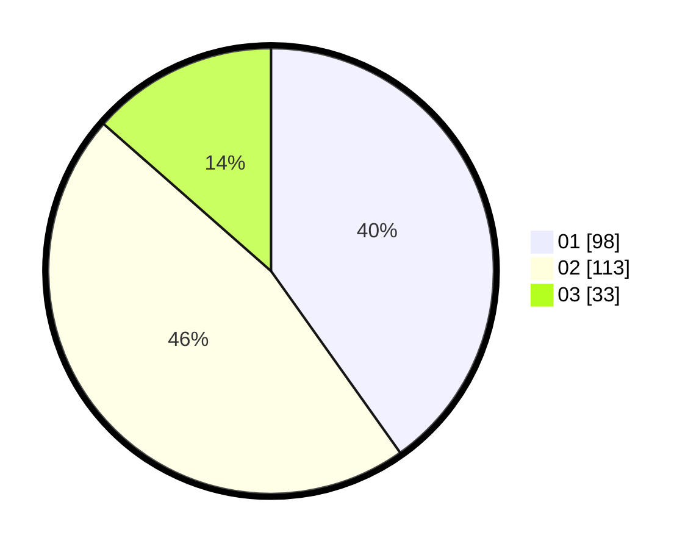

# Hasil

Hasil perolehan suara paslon dapat dilihat pada file paslon-01.txt, paslon-02.txt, dan paslon-03.txt.

Jika tidak ada, artinya data tersebut belum ada pada SIREKAP.

## Perolehan Suara

 * Paslon 01: **98**.
 * Paslon 02: **113**.
 * Paslon 03: **33**.

## Foto C Plano

https://sirekap-obj-formc.kpu.go.id/6b13/pemilu/ppwp/31/75/06/10/03/3175061003089-20240214-213259--69c6c3b3-ff6d-4afe-a1d0-140c762ff850.jpg

https://sirekap-obj-formc.kpu.go.id/6b13/pemilu/ppwp/31/75/06/10/03/3175061003089-20240214-220033--b684247f-3433-45a5-af58-73601698a667.jpg

https://sirekap-obj-formc.kpu.go.id/6b13/pemilu/ppwp/31/75/06/10/03/3175061003089-20240214-205917--8e5e36cb-8c3e-47d3-aabb-b8548fd8384f.jpg
