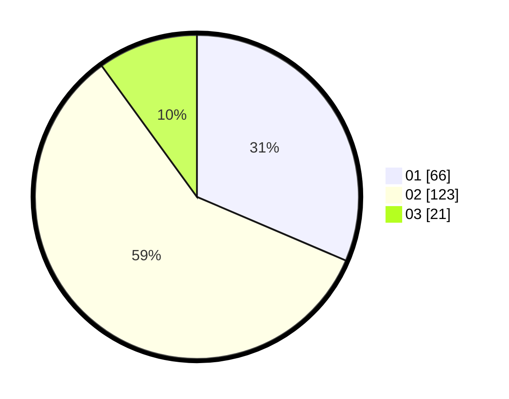

# Hasil

Hasil perolehan suara paslon dapat dilihat pada file paslon-01.txt, paslon-02.txt, dan paslon-03.txt.

Jika tidak ada, artinya data tersebut belum ada pada SIREKAP.

## Perolehan Suara

 * Paslon 01: **66**.
 * Paslon 02: **123**.
 * Paslon 03: **21**.

## Foto C Plano

https://sirekap-obj-formc.kpu.go.id/f78b/pemilu/ppwp/31/75/06/10/03/3175061003090-20240216-215149--af1a50ff-0730-479c-a1a0-aed1644d733d.jpg

https://sirekap-obj-formc.kpu.go.id/f78b/pemilu/ppwp/31/75/06/10/03/3175061003090-20240216-151816--30279844-3c29-4eaa-bf7f-56e7147406ae.jpg

https://sirekap-obj-formc.kpu.go.id/f78b/pemilu/ppwp/31/75/06/10/03/3175061003090-20240216-153201--e82b4769-ba22-451d-83c6-f43b1004817f.jpg

## DATA PEMILIH TETAP

Jumlah pemilih dalam DPT: **280**.
 * L: **147**.
 * P: **133**.

## DATA PENGGUNA HAK PILIH

Jumlah pengguna hak pilih dalam DPT: **216**.
 * L: **108**.
 * P: **108**.

Jumlah pengguna hak pilih dalam DPTb: **0**.
 * L: **0**.
 * P: **0**.

Jumlah pengguna hak pilih dalam DPK: **0**.
 * L: **0**.
 * P: **0**.

Jumlah pengguna hak pilih: **216**.
 * L: **108**.
 * P: **108**.

## JUMLAH SUARA SAH DAN TIDAK SAH

JUMLAH SELURUH SUARA SAH: **210**.

JUMLAH SUARA TIDAK SAH: **6**.

JUMLAH SELURUH SUARA SAH DAN SUARA TIDAK SAH: **216**.
