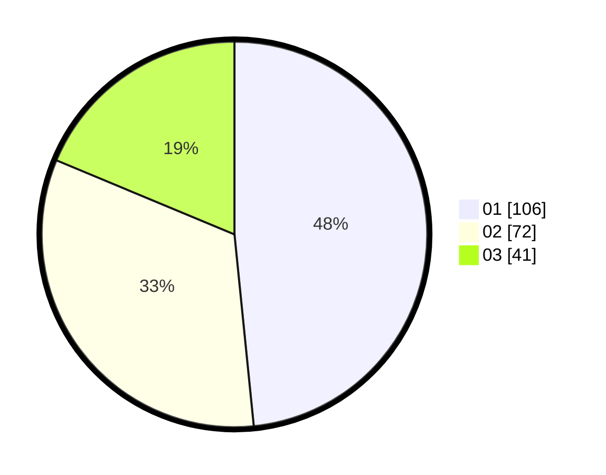

# Hasil

Hasil perolehan suara paslon dapat dilihat pada file paslon-01.txt, paslon-02.txt, dan paslon-03.txt.

Jika tidak ada, artinya data tersebut belum ada pada SIREKAP.

## Perolehan Suara

 * Paslon 01: **106**.
 * Paslon 02: **72**.
 * Paslon 03: **41**.

## Foto C Plano

https://sirekap-obj-formc.kpu.go.id/7aa1/pemilu/ppwp/31/75/06/10/03/3175061003097-20240214-205831--312b60e4-a27d-4327-a763-df637e31ca9a.jpg

https://sirekap-obj-formc.kpu.go.id/7aa1/pemilu/ppwp/31/75/06/10/03/3175061003097-20240214-210048--72403ed5-eaa5-4726-b2bd-cc66087b7741.jpg

https://sirekap-obj-formc.kpu.go.id/7aa1/pemilu/ppwp/31/75/06/10/03/3175061003097-20240214-210251--fa6cdf4e-c06b-4ff4-8c51-23810768f5e8.jpg
