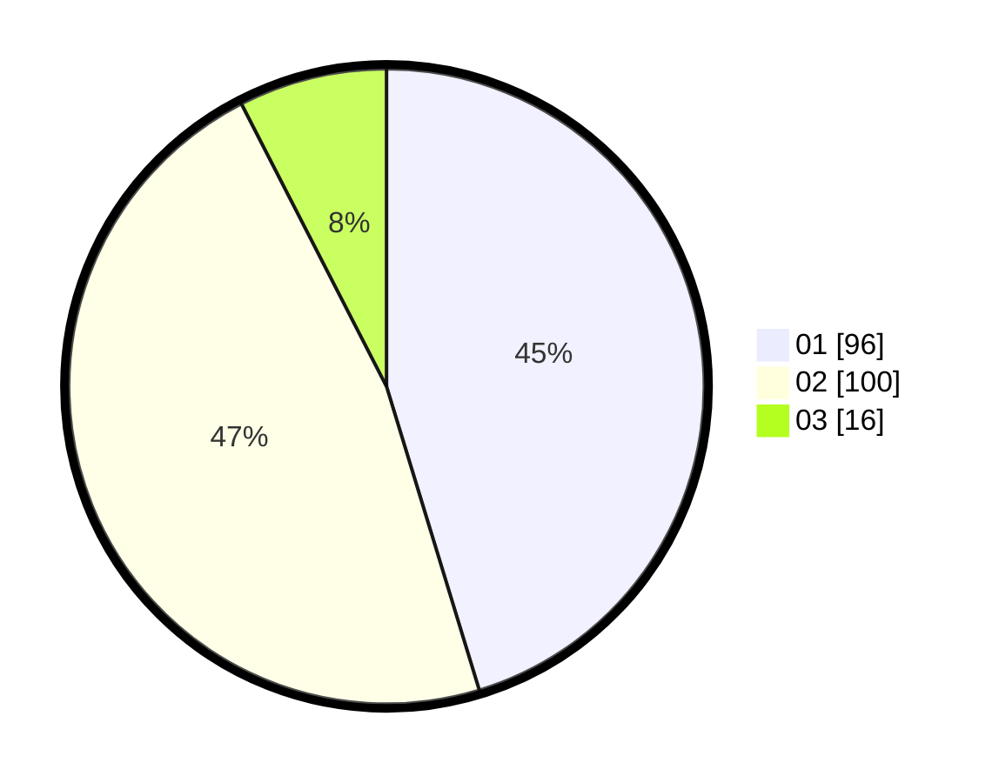

# Hasil

Hasil perolehan suara paslon dapat dilihat pada file paslon-01.txt, paslon-02.txt, dan paslon-03.txt.

Jika tidak ada, artinya data tersebut belum ada pada SIREKAP.

## Perolehan Suara

 * Paslon 01: **96**.
 * Paslon 02: **100**.
 * Paslon 03: **16**.

## Foto C Plano

https://sirekap-obj-formc.kpu.go.id/bd1f/pemilu/ppwp/31/75/06/10/03/3175061003101-20240214-155603--169dd7ee-a5f8-4c57-ab9c-ce91abf86c12.jpg

https://sirekap-obj-formc.kpu.go.id/bd1f/pemilu/ppwp/31/75/06/10/03/3175061003101-20240214-162237--6f1b4132-a1fe-46fe-941b-0312fdb443f6.jpg
