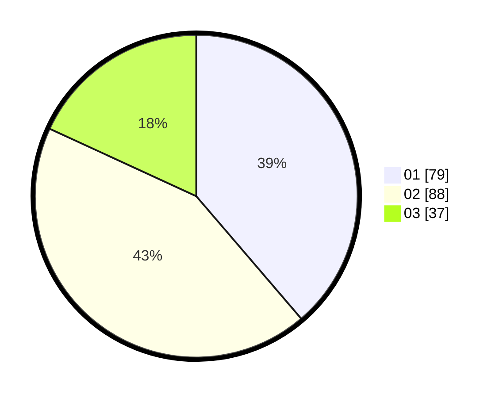

# Hasil

Hasil perolehan suara paslon dapat dilihat pada file paslon-01.txt, paslon-02.txt, dan paslon-03.txt.

Jika tidak ada, artinya data tersebut belum ada pada SIREKAP.

## Perolehan Suara

 * Paslon 01: **79**.
 * Paslon 02: **88**.
 * Paslon 03: **37**.

## Foto C Plano

https://sirekap-obj-formc.kpu.go.id/3c1e/pemilu/ppwp/31/75/06/10/03/3175061003106-20240215-223531--fe2d75af-e597-476a-81d9-57dafa79d2bd.jpg

https://sirekap-obj-formc.kpu.go.id/3c1e/pemilu/ppwp/31/75/06/10/03/3175061003106-20240215-223536--94a0b687-3317-4095-8034-c955a27e5c52.jpg

https://sirekap-obj-formc.kpu.go.id/3c1e/pemilu/ppwp/31/75/06/10/03/3175061003106-20240215-223535--d08f5c74-0de0-4e25-8393-0bb05a5d702a.jpg

## DATA PEMILIH TETAP

Jumlah pemilih dalam DPT: **277**.
 * L: **131**.
 * P: **146**.

## DATA PENGGUNA HAK PILIH

Jumlah pengguna hak pilih dalam DPT: **0**.
 * L: **0**.
 * P: **0**.

Jumlah pengguna hak pilih dalam DPTb: **0**.
 * L: **0**.
 * P: **0**.

Jumlah pengguna hak pilih dalam DPK: **0**.
 * L: **0**.
 * P: **0**.

Jumlah pengguna hak pilih: **0**.
 * L: **0**.
 * P: **0**.

## JUMLAH SUARA SAH DAN TIDAK SAH

JUMLAH SELURUH SUARA SAH: **204**.

JUMLAH SUARA TIDAK SAH: **2**.

JUMLAH SELURUH SUARA SAH DAN SUARA TIDAK SAH: **206**.
