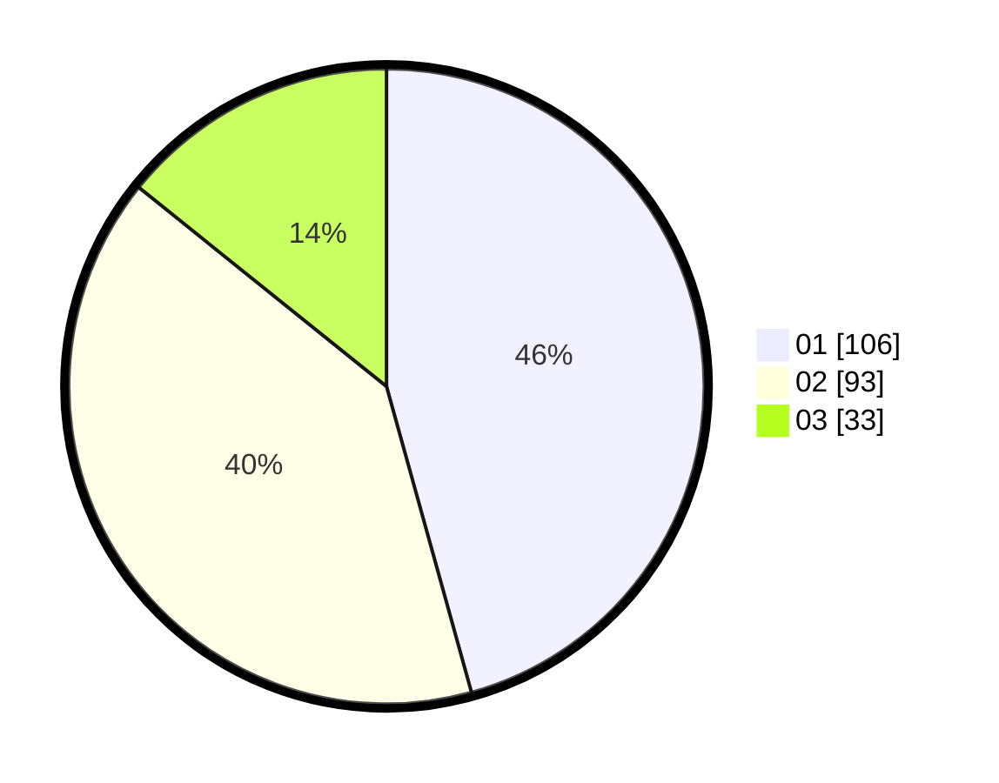

# Hasil

Hasil perolehan suara paslon dapat dilihat pada file paslon-01.txt, paslon-02.txt, dan paslon-03.txt.

Jika tidak ada, artinya data tersebut belum ada pada SIREKAP.

## Perolehan Suara

 * Paslon 01: **106**.
 * Paslon 02: **93**.
 * Paslon 03: **33**.

## Foto C Plano

https://sirekap-obj-formc.kpu.go.id/4809/pemilu/ppwp/31/75/06/10/03/3175061003107-20240215-011449--726f75c5-b971-4a6f-a698-b11940a2dfb6.jpg

https://sirekap-obj-formc.kpu.go.id/4809/pemilu/ppwp/31/75/06/10/03/3175061003107-20240215-011453--05ad6e80-bb7f-4d42-b4d2-f6d3f62af6ac.jpg

https://sirekap-obj-formc.kpu.go.id/4809/pemilu/ppwp/31/75/06/10/03/3175061003107-20240215-011457--20609e8c-c1da-40f4-b35c-adcde5a474e5.jpg
