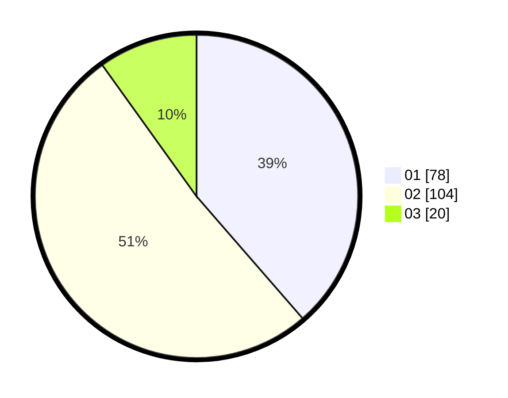

# Hasil

Hasil perolehan suara paslon dapat dilihat pada file paslon-01.txt, paslon-02.txt, dan paslon-03.txt.

Jika tidak ada, artinya data tersebut belum ada pada SIREKAP.

## Perolehan Suara

 * Paslon 01: **78**.
 * Paslon 02: **104**.
 * Paslon 03: **20**.

## Foto C Plano

https://sirekap-obj-formc.kpu.go.id/1012/pemilu/ppwp/31/75/06/10/03/3175061003117-20240216-132714--0dadfcf3-eea7-4542-bc37-d76fb70b0098.jpg

https://sirekap-obj-formc.kpu.go.id/1012/pemilu/ppwp/31/75/06/10/03/3175061003117-20240216-132716--63eca44f-5edd-4530-abd3-241ebd571013.jpg

https://sirekap-obj-formc.kpu.go.id/1012/pemilu/ppwp/31/75/06/10/03/3175061003117-20240216-132715--bff25874-27f5-4c29-9af8-7413ea78b231.jpg

## DATA PEMILIH TETAP

Jumlah pemilih dalam DPT: **285**.
 * L: **134**.
 * P: **151**.

## DATA PENGGUNA HAK PILIH

Jumlah pengguna hak pilih dalam DPT: **206**.
 * L: **93**.
 * P: **113**.

Jumlah pengguna hak pilih dalam DPTb: **2**.
 * L: **1**.
 * P: **1**.

Jumlah pengguna hak pilih dalam DPK: **0**.
 * L: **0**.
 * P: **0**.

Jumlah pengguna hak pilih: **208**.
 * L: **94**.
 * P: **114**.

## JUMLAH SUARA SAH DAN TIDAK SAH

JUMLAH SELURUH SUARA SAH: **202**.

JUMLAH SUARA TIDAK SAH: **6**.

JUMLAH SELURUH SUARA SAH DAN SUARA TIDAK SAH: **208**.
