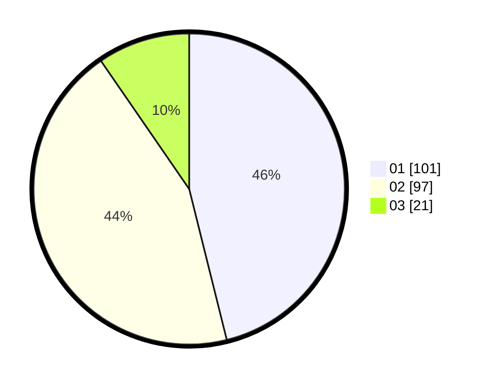

# Hasil

Hasil perolehan suara paslon dapat dilihat pada file paslon-01.txt, paslon-02.txt, dan paslon-03.txt.

Jika tidak ada, artinya data tersebut belum ada pada SIREKAP.

## Perolehan Suara

 * Paslon 01: **101**.
 * Paslon 02: **97**.
 * Paslon 03: **21**.

## Foto C Plano

https://sirekap-obj-formc.kpu.go.id/35c1/pemilu/ppwp/31/75/06/10/03/3175061003130-20240215-214813--67d11262-1313-4651-bb32-fdcf8a8daaed.jpg

https://sirekap-obj-formc.kpu.go.id/35c1/pemilu/ppwp/31/75/06/10/03/3175061003130-20240215-214816--fbb7757c-9230-433c-a777-b26c36648335.jpg

https://sirekap-obj-formc.kpu.go.id/35c1/pemilu/ppwp/31/75/06/10/03/3175061003130-20240215-214815--bd3fcaa0-aa5b-4d0f-bf23-be897f83a9ea.jpg

## DATA PEMILIH TETAP

Jumlah pemilih dalam DPT: **241**.
 * L: **118**.
 * P: **123**.

## DATA PENGGUNA HAK PILIH

Jumlah pengguna hak pilih dalam DPT: **210**.
 * L: **99**.
 * P: **111**.

Jumlah pengguna hak pilih dalam DPTb: **8**.
 * L: **4**.
 * P: **4**.

Jumlah pengguna hak pilih dalam DPK: **2**.
 * L: **0**.
 * P: **2**.

Jumlah pengguna hak pilih: **220**.
 * L: **103**.
 * P: **117**.

## JUMLAH SUARA SAH DAN TIDAK SAH

JUMLAH SELURUH SUARA SAH: **219**.

JUMLAH SUARA TIDAK SAH: **1**.

JUMLAH SELURUH SUARA SAH DAN SUARA TIDAK SAH: **220**.
