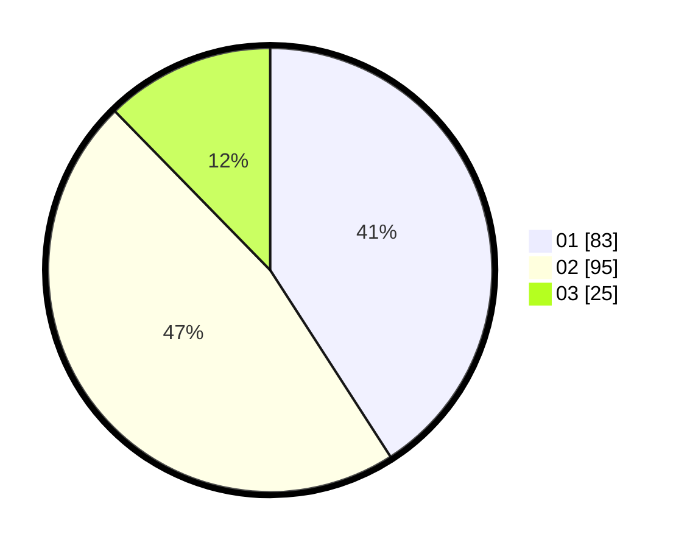

# Hasil

Hasil perolehan suara paslon dapat dilihat pada file paslon-01.txt, paslon-02.txt, dan paslon-03.txt.

Jika tidak ada, artinya data tersebut belum ada pada SIREKAP.

## Perolehan Suara

 * Paslon 01: **83**.
 * Paslon 02: **95**.
 * Paslon 03: **25**.

## Foto C Plano

https://sirekap-obj-formc.kpu.go.id/da5a/pemilu/ppwp/31/75/06/10/03/3175061003138-20240215-001452--91de0525-99fe-4e83-b808-6ce252b96f1e.jpg

https://sirekap-obj-formc.kpu.go.id/da5a/pemilu/ppwp/31/75/06/10/03/3175061003138-20240214-223537--cc6af52b-67b5-442c-aeec-4d31e967f8ce.jpg

https://sirekap-obj-formc.kpu.go.id/da5a/pemilu/ppwp/31/75/06/10/03/3175061003138-20240214-223749--0cf2f736-cfdb-4fc8-a97d-9eab0f05cab0.jpg
