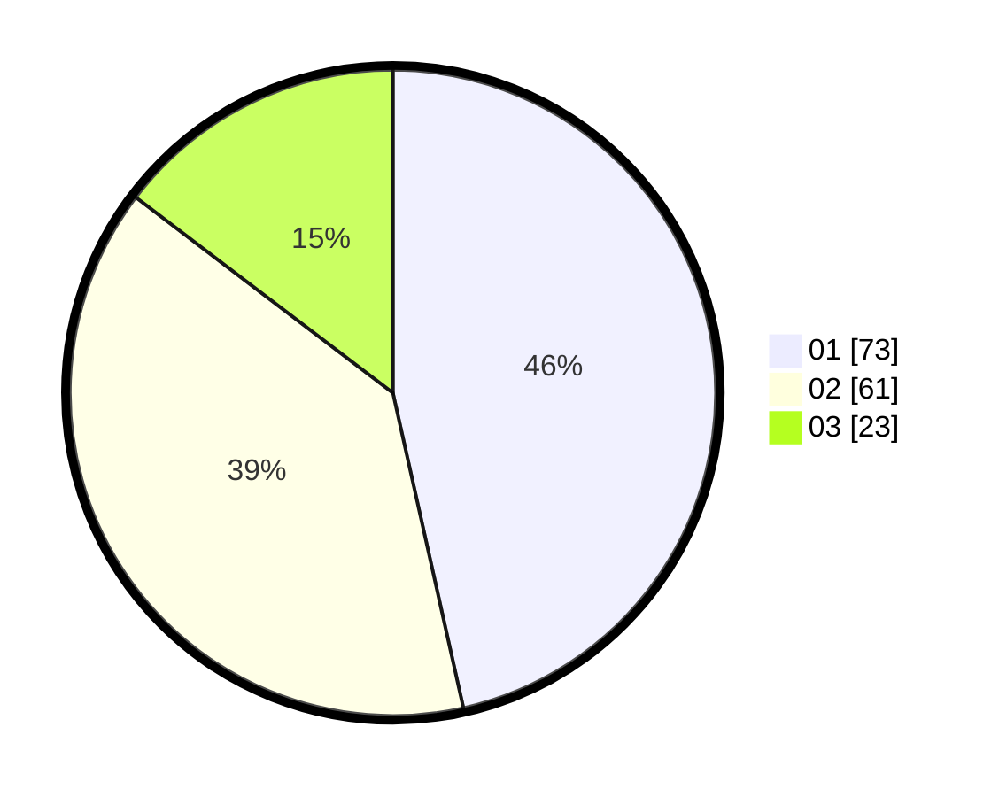

# Hasil

Hasil perolehan suara paslon dapat dilihat pada file paslon-01.txt, paslon-02.txt, dan paslon-03.txt.

Jika tidak ada, artinya data tersebut belum ada pada SIREKAP.

## Perolehan Suara

 * Paslon 01: **73**.
 * Paslon 02: **61**.
 * Paslon 03: **23**.

## Foto C Plano

https://sirekap-obj-formc.kpu.go.id/d17e/pemilu/ppwp/31/75/06/10/03/3175061003144-20240214-231733--e5f9479b-45aa-43f5-8022-6bec52df63ae.jpg

https://sirekap-obj-formc.kpu.go.id/d17e/pemilu/ppwp/31/75/06/10/03/3175061003144-20240214-231822--eeb2bd56-b9e3-4ea4-ba6e-69b66e5113e3.jpg

https://sirekap-obj-formc.kpu.go.id/d17e/pemilu/ppwp/31/75/06/10/03/3175061003144-20240214-231903--94708f58-f7e5-49ef-9a1b-07c94d3e5a35.jpg
