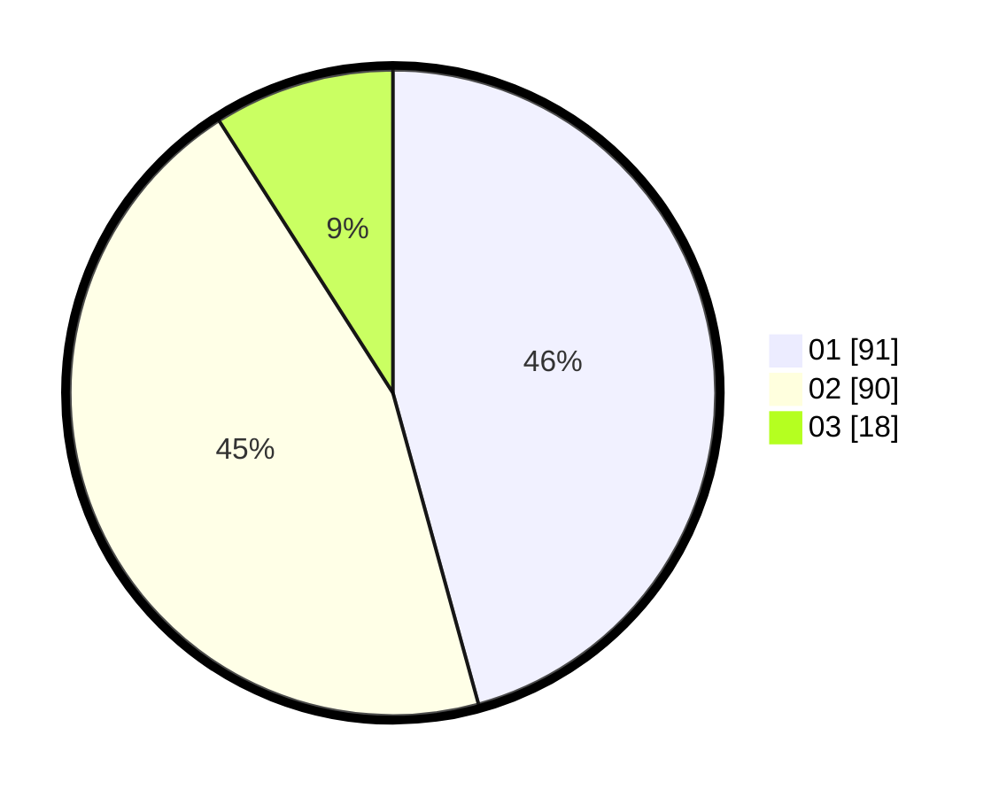

# Hasil

Hasil perolehan suara paslon dapat dilihat pada file paslon-01.txt, paslon-02.txt, dan paslon-03.txt.

Jika tidak ada, artinya data tersebut belum ada pada SIREKAP.

## Perolehan Suara

 * Paslon 01: **91**.
 * Paslon 02: **90**.
 * Paslon 03: **18**.

## Foto C Plano

https://sirekap-obj-formc.kpu.go.id/3a60/pemilu/ppwp/31/75/06/10/03/3175061003151-20240214-213451--224cdfe5-32cc-45b7-8636-43ebbb891889.jpg

https://sirekap-obj-formc.kpu.go.id/3a60/pemilu/ppwp/31/75/06/10/03/3175061003151-20240214-213645--e5674ac7-b5dd-4a52-8f3f-f86c5ef28557.jpg

https://sirekap-obj-formc.kpu.go.id/3a60/pemilu/ppwp/31/75/06/10/03/3175061003151-20240214-190055--9028ad7d-ca00-4f33-b48b-dfe237649d6e.jpg

## DATA PEMILIH TETAP

Jumlah pemilih dalam DPT: **269**.
 * L: **133**.
 * P: **136**.

## DATA PENGGUNA HAK PILIH

Jumlah pengguna hak pilih dalam DPT: **201**.
 * L: **98**.
 * P: **103**.

Jumlah pengguna hak pilih dalam DPTb: **0**.
 * L: **0**.
 * P: **0**.

Jumlah pengguna hak pilih dalam DPK: **1**.
 * L: **0**.
 * P: **1**.

Jumlah pengguna hak pilih: **202**.
 * L: **98**.
 * P: **104**.

## JUMLAH SUARA SAH DAN TIDAK SAH

JUMLAH SELURUH SUARA SAH: **199**.

JUMLAH SUARA TIDAK SAH: **3**.

JUMLAH SELURUH SUARA SAH DAN SUARA TIDAK SAH: **202**.
