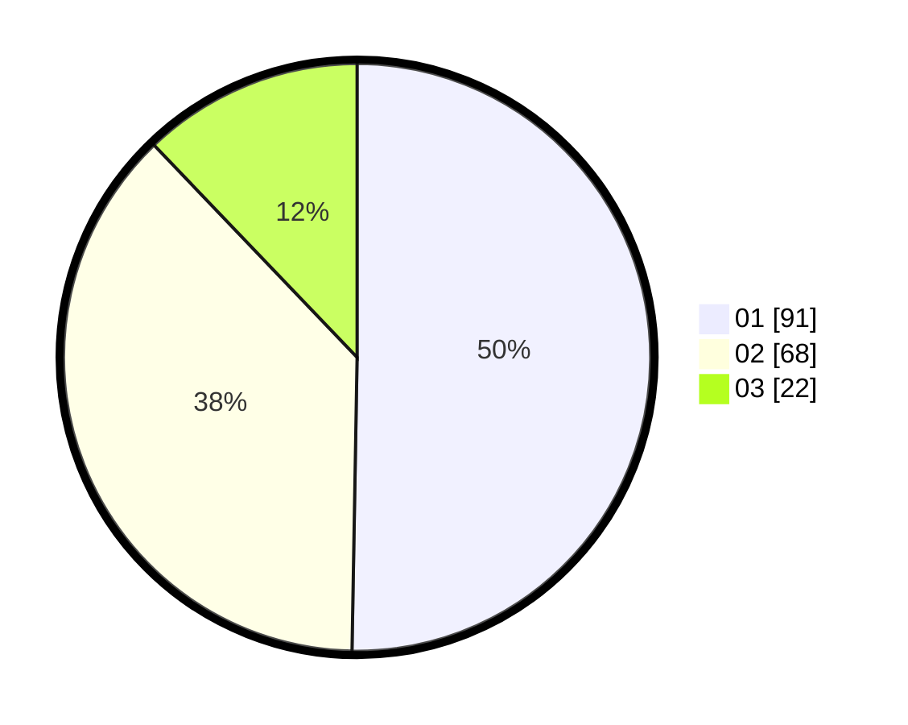

# Hasil

Hasil perolehan suara paslon dapat dilihat pada file paslon-01.txt, paslon-02.txt, dan paslon-03.txt.

Jika tidak ada, artinya data tersebut belum ada pada SIREKAP.

## Perolehan Suara

 * Paslon 01: **91**.
 * Paslon 02: **68**.
 * Paslon 03: **22**.

## Foto C Plano

https://sirekap-obj-formc.kpu.go.id/a28e/pemilu/ppwp/31/75/06/10/03/3175061003156-20240214-230312--2a744024-749d-4833-9a1b-2091ec12c8ff.jpg

https://sirekap-obj-formc.kpu.go.id/a28e/pemilu/ppwp/31/75/06/10/03/3175061003156-20240214-230354--14e913fd-f051-4aa5-ab3c-929787939ff9.jpg

https://sirekap-obj-formc.kpu.go.id/a28e/pemilu/ppwp/31/75/06/10/03/3175061003156-20240214-230455--768d533d-999d-466e-ac41-cea07f283a2d.jpg
