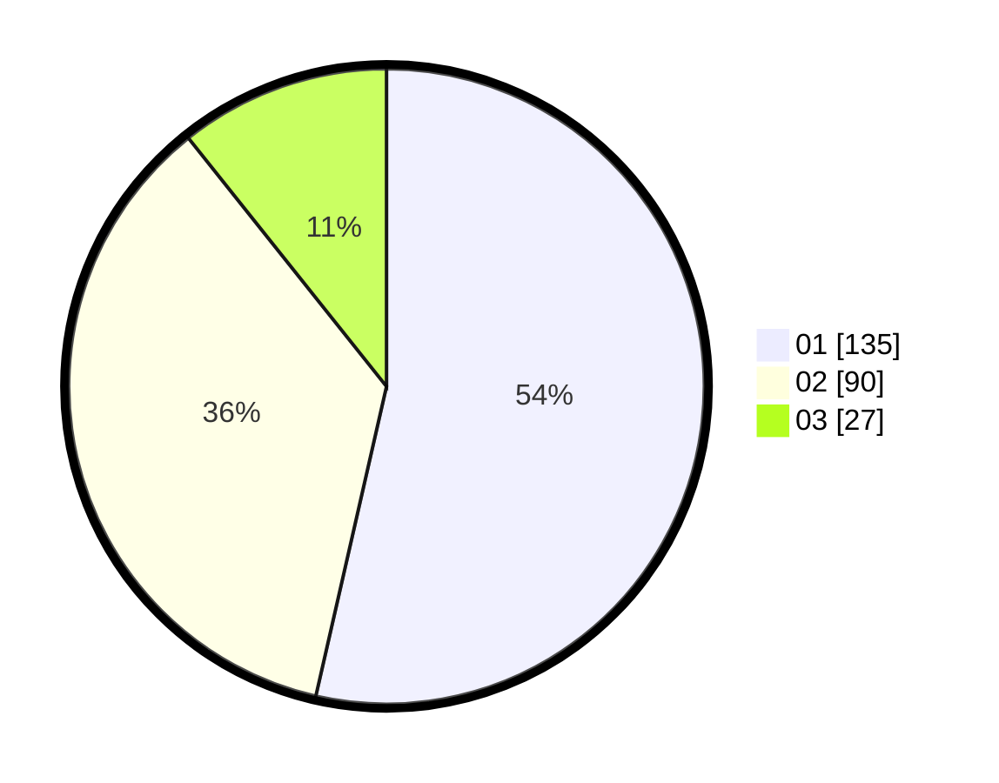

# Hasil

Hasil perolehan suara paslon dapat dilihat pada file paslon-01.txt, paslon-02.txt, dan paslon-03.txt.

Jika tidak ada, artinya data tersebut belum ada pada SIREKAP.

## Perolehan Suara

 * Paslon 01: **135**.
 * Paslon 02: **90**.
 * Paslon 03: **27**.

## Foto C Plano

https://sirekap-obj-formc.kpu.go.id/9757/pemilu/ppwp/31/75/06/10/03/3175061003170-20240216-053945--835eedb4-d064-4b80-992d-f9d48ec48de7.jpg

https://sirekap-obj-formc.kpu.go.id/9757/pemilu/ppwp/31/75/06/10/03/3175061003170-20240216-053947--df793e95-8a9c-4f97-833d-2af991d4813a.jpg

https://sirekap-obj-formc.kpu.go.id/9757/pemilu/ppwp/31/75/06/10/03/3175061003170-20240216-053946--52bf9902-5391-4075-92c5-e59a6e5678e8.jpg

## DATA PEMILIH TETAP

Jumlah pemilih dalam DPT: **299**.
 * L: **152**.
 * P: **147**.

## DATA PENGGUNA HAK PILIH

Jumlah pengguna hak pilih dalam DPT: **250**.
 * L: **123**.
 * P: **127**.

Jumlah pengguna hak pilih dalam DPTb: **1**.
 * L: **0**.
 * P: **1**.

Jumlah pengguna hak pilih dalam DPK: **3**.
 * L: **1**.
 * P: **2**.

Jumlah pengguna hak pilih: **254**.
 * L: **124**.
 * P: **130**.

## JUMLAH SUARA SAH DAN TIDAK SAH

JUMLAH SELURUH SUARA SAH: **252**.

JUMLAH SUARA TIDAK SAH: **2**.

JUMLAH SELURUH SUARA SAH DAN SUARA TIDAK SAH: **254**.
