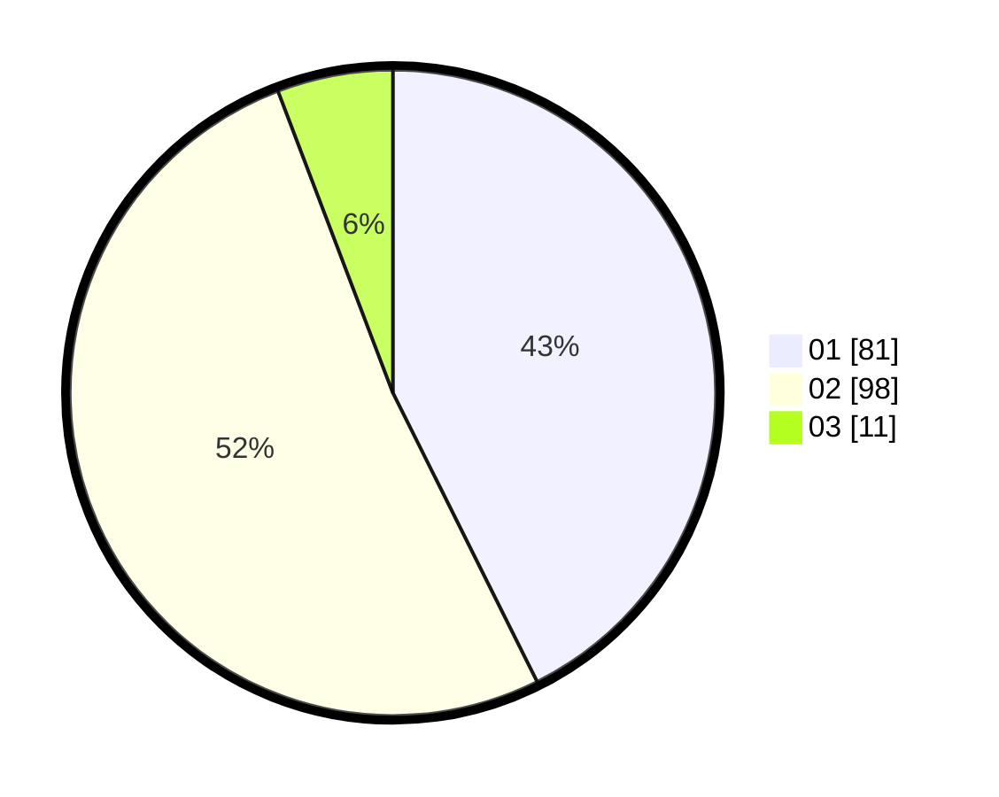

# Hasil

Hasil perolehan suara paslon dapat dilihat pada file paslon-01.txt, paslon-02.txt, dan paslon-03.txt.

Jika tidak ada, artinya data tersebut belum ada pada SIREKAP.

## Perolehan Suara

 * Paslon 01: **81**.
 * Paslon 02: **98**.
 * Paslon 03: **11**.

## Foto C Plano

https://sirekap-obj-formc.kpu.go.id/aa90/pemilu/ppwp/31/75/06/10/03/3175061003171-20240214-214405--5131ee23-4dd6-400f-80f4-57d053e2dc15.jpg

https://sirekap-obj-formc.kpu.go.id/aa90/pemilu/ppwp/31/75/06/10/03/3175061003171-20240214-214442--e186b4dc-acfc-44a2-a6c3-8f66e57c9d0d.jpg
